# LibreChat generation protocol v2: deployed-server reverse engineering

**Server examined:** LibreChat `b2128a7d189ac020ebb6e49a57ee986e98326b77` (the supplied checkout; `git rev-parse HEAD` verified).  
**Native client compared:** `Packages/LibreChatCore/Sources/LibreChatProtocol/Generation*.swift` and `LibreChat/Data/Repositories/LibreChatRepository.swift` in this workspace.  
**Scope:** the authenticated Agents chat path (`/api/agents/chat/*`), not OpenAI-compatible `/api/agents/v1/*` or Open Responses.

This is a protocol report, not an app-source change. “Must” below means required for a v2-compatible mobile implementation, unless marked **recommended**.

## Executive conclusion

The v2 protocol is a **two-channel, server-owned generation job protocol**:

1. `POST /api/agents/chat/:endpoint` creates or idempotently discovers a background job and returns a receipt immediately.
2. `GET /api/agents/chat/stream/:streamId` carries the generation over SSE.

`streamId` is normally the `conversationId`, so it is deliberately reusable. The opaque generation identity is the pair:

```text
(streamId/conversationId, generationCreatedAt)
```

Every later stream attach, stop, resume, status interpretation, replacement handoff, and terminal teardown must be fenced to that epoch. Treating a conversation ID alone as an active run can display a different user turn, abort it, or attach an old optimistic submission to it.

The current iOS client implements the verified native baseline for the deployed v2 contract: deterministic new-conversation identity, typed readiness handling, same-request start retries, idempotent status retries, structured synchronization, status reconciliation, server-backed active-job discovery, epoch replacement fencing, server-confirmed stop, and `/resume` HITL payloads. The safety boundary requires exact response-message identity, rejects malformed/unknown/identity-mismatched start receipts, preserves aborted/error terminals, permits active ambiguous recovery only with exact status proof, and fails closed for existing-conversation ambiguity. `ChatRepository.send` returns a typed `ChatSendOutcome`: only `streaming` exposes a `GenerationHandle`; terminal outcomes use authoritative history and never attach SSE. Winner handoff requires exact active v2 stream/epoch/protocol proof, removes losing optimism, restores/persists draft text, and never misattributes the winner. Typed HITL decisions require full handle plus interaction identity and reconcile ambiguity without reposting. MessageTree projection preserves server sibling order and exact send/share tails; save-only edits and bounded response regeneration use exact coordinates and fail closed. Skills now have a bounded Core contract: fresh preflight validates the account/target-scoped catalog and selected names, then generation sends top-level `manualSkills`; regeneration replays persisted selections and the pending queue blocks selected Skills until preflight succeeds. Steering read/recovery is package-tested; exact v2 mutation transport and native guidance are compile-verified but not Simulator/live-proven. Phase C includes a V2 SwiftData queue journal/migration, enqueue/status/remove UI for text and completed same-target attachments, exact clean-terminal one-at-a-time drain, lifecycle no-repost reconciliation, queued-upload ownership/hold renewal, jobless delivered-without-epoch blocking, and keep/send-next/server-confirmed-dismiss leftover choices. Unsafe or non-completed terminals block followers; file-bearing terminal recovery stays disabled. Active-state Skill mutation UI, authoring/files/import, durable pending-Skill selection persistence, quotes, new-conversation queueing, background initiation, structured assistant resubmit, Continue, message deletion, server-branch mutations, and live self-hosted proof remain open or distinct. See [SkillsAndManualInvocation.md](SkillsAndManualInvocation.md) and [Prioritized gap matrix](#prioritized-gap-matrix).

## Terminology and non-negotiable invariants

| Term | Meaning | Required client behaviour |
|---|---|---|
| `streamId` | In agents chat, normally exactly `conversationId`; reused by later turns. | Never use alone as a durable run identity. |
| `createdAt` / `generationCreatedAt` | Server-assigned non-negative safe integer epoch. Start receipts name it `generationCreatedAt`; status calls name it `createdAt`. | Persist it with every live handle; send it for stream attach, abort and HITL resume. |
| v2 | Negotiated immutable protocol of a job. | Enable v2-only semantics only when response JSON explicitly says numeric `2`. |
| `clientRequestId` | Stable, client-minted 1–128 character `[A-Za-z0-9:_-]` submission identity. | Generate once per logical send and reuse across every ambiguous-start retry. Do not recreate it. |
| New-conversation identity | For a `"new"` placeholder, the server derives the real conversation ID as UUIDv5 of `userId:clientRequestId` under namespace `d7f2518c-94b8-4fe8-97ad-2d4bdb2c9f43`. | Reproduce the exact namespace/name/UUIDv5 algorithm; never substitute `"new"` or a random ID for an idempotent retry. |
| `expectedPredecessorCreatedAt` | Epoch observed before starting a queued follow-up/recovery turn. | Include it when replacing/draining after a known predecessor; carry it through completed/aborted/failed terminal snapshots, and treat a mismatch as reconciliation, never a blind retry. |
| pending terminal persistence | A terminal CAS has won but required DB/checkpoint work is unfinished. | On `SERVER_NOT_READY`, wait/retry; do not clear local generation or refetch as if history is authoritative. |

Server source: protocol negotiation is in `api/server/controllers/agents/protocol.js:1-66`; job/epoch contracts are in `packages/api/src/types/stream.ts:7-84` and `packages/api/src/stream/interfaces/IJobStore.ts:19-209`. Server routes consistently authorize both `userId` and (when present) `tenantId` before exposing a job (`api/server/routes/agents/index.js:44-66,156-210,417-443`).

### State model

```mermaid
stateDiagram-v2
  [*] --> Starting: POST accepted / status=started
  Starting --> Streaming: initial SSE + created/chunks
  Starting --> Reconciling: receipt is resumed/replaced/settled/mismatch
  Streaming --> Reconnecting: SSE transport closes/errors
  Reconnecting --> Streaming: resume=true => sync, pendingEvents, activate
  Streaming --> AwaitingAction: on_pending_action; server requires_action
  AwaitingAction --> Streaming: POST /resume wins action+epoch CAS
  AwaitingAction --> Aborted: POST abort wins CAS
  Streaming --> Aborted: abort/preempt wins CAS
  Streaming --> Completed: durable FINAL
  Streaming --> Failed: SSE error or authoritative reconciliation outcome
  Reconciling --> Streaming: status confirms same active epoch; fenced attach
  Reconciling --> Completed: history/status says no active matching epoch
  Reconciling --> [*]: replacement is handed off to a new handle
  Completed --> [*]
  Aborted --> [*]
  Failed --> [*]
```



The server has durable statuses `running`, `requires_action`, `complete`, `error`, and `aborted` (`packages/api/src/types/stream.ts:41-55`). `requires_action` is active only while its pending action is valid; expiration/malformed action is terminalized rather than left visible (`api/server/routes/agents/index.js:468-515`).

## Protocol negotiation

### How to advertise v2

Send all three copies of the same marker on every generation/control request:

```http
X-LibreChat-Generation-Protocol: 2
Content-Type: application/json

{ "generationProtocolVersion": 2, ... }

GET ...?generationProtocolVersion=2
```

The deployed web client applies header and body to JSON POSTs, and header/query to SSE (`client/src/data-provider/SSE/protocol.ts:1-99`, `client/src/hooks/SSE/useResumableSSE.ts:1404-1423`). The server reads body, query, and lowercase header. If none are present, one is invalid, or they disagree, it selects v1; only *all* advertised values equalling 2 request v2 (`api/server/controllers/agents/protocol.js:8-35`). A new job chooses `min(requested, server gate)` and then keeps that exact protocol for its lifetime. Existing jobs choose `min(requested, job marker)` (`protocol.js:37-66`).

The server echoes the effective numeric protocol in **both** `X-LibreChat-Generation-Protocol` and every JSON response body. The response body is authoritative because auth-refresh adapters can lose headers (`api/server/routes/agents/index.js:59-66`). In Redis/rolling deployments the server defaults to v1 unless `GENERATION_PROTOCOL_VERSION=2`; a client must fail closed, not assume “I asked for 2, therefore it is 2.”

**iOS:** sends the v2 marker on start, status, stream, abort, and resume requests; accepts a generation only when the response body proves protocol `2`; and rejects an active status whose stream/epoch does not match the discovered job (`LibreChatRepository.swift:466-548`). This is a fail-closed recovery boundary. Broader response-marker enforcement on every future control response and richer event preservation remain hardening work.

## HTTP endpoint contracts

All listed routes are JWT-authenticated and ban-checked. Chat start/resume additionally traverses PII moderation, agent use/resource permission, conversation access, and endpoint construction (`api/server/routes/agents/chat.js:74-119`). This is why a mobile client cannot replace a server resume with a local continuation.

| Operation | Method/path | Required v2 identity/body | Success / significant outcomes |
|---|---|---|---|
| Start | `POST /api/agents/chat/:endpoint` (or `/chat/` regular route) | Normal chat payload plus `clientRequestId`, `generationProtocolVersion:2`; optional `expectedPredecessorCreatedAt`, recovery fields. | `200 {streamId, conversationId, generationCreatedAt, status:"started"\|"resumed"\|"replaced"\|"settled", generationProtocolVersion:2}`. |
| Attach | `GET /api/agents/chat/stream/:streamId` | Query `generationCreatedAt`, `resume=true` when reconnecting, protocol query; Bearer auth, protocol header, Accept SSE. | `200 text/event-stream`; `400 INVALID generation identity`; `403`; `404`; `409 GENERATION_REPLACED`; or a post-header reconciliation final. |
| Active list | `GET /api/agents/chat/active` | No body. | `{activeJobIds:string[]}` only; owner+tenant scoped. |
| Status/recovery | `GET /api/agents/chat/status/:conversationId` | Protocol query/header. | `active`, `status`, `streamId`, `createdAt`, `resumeState`, safe `pendingAction`, maybe `unrecoveredSteers`. See below. |
| Stop | `POST /api/agents/chat/abort` | `streamId` or `conversationId` (or legacy `abortKey`), **and** `generationCreatedAt`; protocol body/header. | `success:true`, or v2 reconciliation/readiness outcomes; never locally assert success before this answer/final. |
| Human decision | `POST /api/agents/chat/resume` | `conversationId`, `actionId`, `generationCreatedAt`, original `endpoint` and `agent_id` when present, protocol, plus decision payload. | `200 {streamId,conversationId,status:"resuming"}`; existing SSE continues. |
| Queue steer | `POST /api/agents/chat/steer` | Conversation/stream + current epoch + text + stable `clientSteerId`; optional files/preempt (exact type is server data-provider contract). | 202/response receipt; queue reconciliation is via SSE/status. |
| Cancel / arm steer | `POST /api/agents/chat/steer/cancel`, `/arm` | Receipt/steer identity and epoch. | A false result means it may already be applied/ended, not necessarily an error. |

### Start, receipt, and idempotency

The start controller creates the job and returns its receipt *before* client/provider construction or model output. Background work proceeds even if no SSE subscriber attaches; early events are buffered/persisted (`api/server/controllers/agents/request.js:873-956`, `packages/api/src/stream/GenerationJobManager.ts:2208-2241`). A caller can attach immediately after the receipt.

For a new conversation, a non-empty `clientRequestId` deterministically derives the server `conversationId` from `(userId, clientRequestId)`; otherwise it is random (`request.js:207-212,445-452`). Therefore regenerate neither ID on retry. The server claims the request before concurrency admission and atomically binds create to that claim. Duplicate behavior is intentionally conservative:

| Situation | Server result | Client action |
|---|---|---|
| Existing same live job | `200 status:"resumed"`, its epoch | Attach with `resume=true`; preserve same logical submission. |
| Existing claim but job still being created/finalizing/ownership unclear | `503 code:"SERVER_NOT_READY"`, `Retry-After: 1` | Retry same POST with same `clientRequestId`; do not make a fresh request ID. |
| Existing claim's job is gone after it started | v2 `200 status:"settled"` (no attachable stream) | Refetch authoritative conversation/messages; stop optimistic stream. |
| Same stream is now a different active generation | v2 `200 status:"replaced"` and winning epoch; legacy can be `409 RUN_REPLACED` | Do not attach old submission to it. Fetch status, rebuild the **winning** generation handle/snapshot, then attach fenced to that epoch. |
| `expectedPredecessorCreatedAt` is no longer the current predecessor | `409 code:"GENERATION_PREDECESSOR_MISMATCH", status:"predecessor_mismatch"`, winner data/`predecessorVerified` | Reconcile/hand off; keep queued source text rather than post it again blindly. |

References: client ID validation and stable new-conversation stream derivation `request.js:342-452`; claim/adoption/takeover flow `request.js:482-850`; creation receipt `request.js:881-948`; predecessor mismatch envelope `request.js:1851-1908`; atomic store invocation `GenerationJobManager.ts:1903-2014`.

#### Deterministic new-chat identity and recovery

The deployed server source defines `NEW_CONVERSATION_IDEMPOTENCY_NAMESPACE = "d7f2518c-94b8-4fe8-97ad-2d4bdb2c9f43"` and derives a new conversation as UUIDv5 of the UTF-8 name `userId:clientRequestId` under that namespace (`api/server/controllers/agents/request.js:211,449-451`). The native `LibreChatGenerationIdentity` reproduces that UUIDv5 algorithm and has a source-backed regression vector (`Packages/LibreChatCore/Sources/LibreChatProtocol/GenerationIdentity.swift:4-34`; `GenerationV2ContractTests.swift:13-20`).

An ambiguous start does not fetch or invent a `/new` history record. After the same start request has exhausted transport/readiness handling, the client asks status for the deterministic derived conversation ID. It may adopt an active result only for a local new-chat submission and only when status proves `running` or `requires_action`, exact stream equals the derived conversation, a non-negative epoch exists, and protocol is exactly `2`. For an existing conversation, an active status after an ambiguous POST does not prove idempotency ownership, so the original transport failure wins and the client attaches to nothing. An inactive `complete`/`settled` status is accepted only when history contains the exact submitted `messageId`; `aborted` and `error` return their matching terminal receipt rather than completion (`LibreChatRepository.swift:1180-1254`).

Start-receipt validation is similarly strict. Only the known statuses `started`, `resumed`, `settled`, `aborted`, `error`, `replaced`, and `predecessor_mismatch` are accepted; every receipt needs a non-empty conversation ID; an attachable receipt additionally needs matching non-empty stream/conversation IDs and an epoch. Unknown, malformed, protocol-mismatched, or identity-mismatched receipts fail closed. A settled or jobless reconciliation refreshes history, but an assistant answer is attributed only when status names its exact `resumeState.responseMessageId`; the client never selects a convenient latest assistant response from another generation.

The parent chain is also explicit: the start payload uses the selected target parent when present, otherwise the caller-provided canonical parent, otherwise the all-zero root ID. `ChatModel` captures the last canonical message before appending optimistic user/assistant rows, so an optimistic temporary ID is never sent as the parent (`LibreChatRepository.swift:279-303`; `ChatModel.swift:130-159`). A `"new"` navigation item is replaced by the real receipt conversation ID after start; `SignedInRootView` aliases the temporary identity so the active navigation stack follows the server conversation (`ChatModel.swift:284-294`; `SignedInRootView.swift:54-73,115-123`).

Generation admission now has an authoritative routing prerequisite. New Chat receives an explicitly selected `ConversationTarget` from an account-scoped `TargetCatalogSnapshot` derived from fresh authenticated config/endpoints/models plus agent ACL and non-secret user-key evidence. A successful local draft stores the exact selected option as a validated 1...2,048 UTF-16-unit value in the existing profile/account `recent-chat-target-v1` configuration payload; failed or canonical/server-created results do not write it. A fresh catalog uses that value only if the option remains authorized, otherwise its server/spec default wins. This does not add a SwiftData V1 column or migration. Existing server conversations must hydrate the canonical conversation target and authoritative message history before `ChatModel` enables send; uploads require canonical routing. Cached messages and drafts remain available when hydration fails, but they cannot authorize a mutation. After local identity promotion the model deliberately drops inferred routing, refetches canonical conversation/history, and only then re-enables later sends. Target/recent-target/hydration app tests compile but have not run on Simulator or a live authenticated deployment.

#### Typed start outcomes and predecessor safety

The repository boundary does not expose a handle for every HTTP-success receipt. `ChatRepository.send` returns `ChatSendOutcome`: `streaming(GenerationHandle)` is the only attachable result; `settled`, `aborted`, and `failed` are terminal outcomes that require authoritative history and must never open SSE or manufacture an assistant-message attribution. A local draft may be promoted to its canonical conversation ID only after a valid server receipt. If the follow-up history read fails transiently, the claimed submission and optimistic state are retained locally and are never reposted merely because history was unavailable; the editable draft remains cleared.

The original `clientRequestID` is reused across every bounded readiness/transport retry, preserving server idempotency. `expectedPredecessorCreatedAt` is carried into completed, aborted, and failed terminal snapshots and is never superseded by a later inferred epoch. A typed `409` predecessor/replacement response preserves its proof details; a `replaced` or `predecessor_mismatch` result never attaches the losing request. Handoff additionally requires an exact active v2 receipt/status proof for stream ID, epoch, and protocol, with a different expected predecessor epoch. Losing optimistic rows are removed, unsent draft text is restored and persisted, and a verified terminal or superseded winner never opens SSE. A transient failure retains visible manual Resume; no automatic resend or losing `clientRequestID` reuse is permitted. Active reconciliation requires exact stream ID, protocol, and a non-negative epoch. A verified different epoch marks the saved generation superseded; missing, mismatched, or malformed proof returns `invalidResponse` before synchronization. Proof-status `401` propagates as authorization failure rather than being treated as a missing generation.

### Start request minimum fixture

The exact provider/endpoint fields vary, but this is the v2 envelope shape the native fixture suite should send:

```json
{
  "text": "Hello",
  "sender": "User",
  "isCreatedByUser": true,
  "messageId": "<stable-message-id-for-this-attempt>",
  "parentMessageId": "<parent-or-zero-id>",
  "conversationId": "<id-or-new>",
  "endpoint": "agents",
  "agent_id": "<agent-id when agents>",
  "model": "<as-selected>",
  "isTemporary": false,
  "isRegenerate": false,
  "isContinued": false,
  "timezone": "Europe/Rome",
  "clientRequestId": "<REUSED-on-retry>",
  "generationProtocolVersion": 2,
  "expectedPredecessorCreatedAt": 1234567890123
}
```

`isTemporary` is `true` for a Temporary Chat and `false` otherwise. The
authenticated interface/role gate, server-retention semantics, upload bit, and
native cache exclusions are specified in [TemporaryChat.md](TemporaryChat.md);
the client must never infer this flag from the title or local navigation state.

`expectedPredecessorCreatedAt` is omitted for a normal first start. Normal endpoint authorization/shape validation remains endpoint-specific; it is not replaced by v2.

### Status and active recovery

`/chat/active` is a discovery list, not enough to recover a handle: it has no epoch or snapshot. For each relevant conversation, call `/chat/status/:conversationId`. The status handler authorizes a job, reads resume state fenced to its epoch, re-reads the job, and retries that authorization/snapshot pair up to three times. It returns `503 SERVER_NOT_READY` + `Retry-After:1` if it cannot prove a stable snapshot (`api/server/routes/agents/index.js:400-447`).

The native recovery coordinator follows the same contract. It first installs and reconciles cached nonterminal handles, then calls `/chat/active`, deduplicates `activeJobIds`, and requests status for each discovered conversation. A discovered job is accepted only when `active == true`, `streamId` equals the discovered ID, `createdAt` is a valid non-negative epoch, and `generationProtocolVersion == 2`. Existing cached handles are reused only for the same `(streamId, createdAt)`; a different epoch is a replacement and cannot mutate the old snapshot. The coordinator persists the authoritative status snapshot but does not attach a global SSE stream; the conversation-specific model attaches only when that conversation is opened (`LibreChatRepository.swift:466-548`).

Active discovery is best-effort for optional/older deployments: transport errors and `/active` 404/405 return retained local checkpoints without hiding authenticated cache. Unauthorized responses remain fatal and follow session expiry. Profile/account and full-handle identity checks are enforced before status results are installed.

Typical active response:

```json
{
  "active": true,
  "streamId": "conversation-id",
  "status": "running",
  "createdAt": 1234567890123,
  "generationProtocolVersion": 2,
  "aggregatedContent": ["...content parts..."],
  "resumeState": {
    "runSteps": [],
    "aggregatedContent": [],
    "userMessage": {"messageId":"...","text":"..."},
    "responseMessageId": "...",
    "conversationId": "...",
    "sender": "...",
    "iconURL": "...",
    "model": "...",
    "titleEvent": {"event":"title","data":{"title":"..."}},
    "replayEvents": [],
    "collectedUsage": [],
    "contextUsage": {},
    "pendingAction": {"actionId":"...","payload":{}},
    "pendingSteers": []
  },
  "pendingAction": {"actionId":"...","payload":{}}
}
```

`requires_action` with a non-expired action is `active:true`; the safe pending-action projection deliberately excludes `resumeContext` and request fingerprint. A jobless/non-active response may include `unrecoveredSteers`; those are persisted server-side leftover inputs that must be converted into recoverable queued turns, not discarded (`index.js:68-93,468-516`).

`GenerationJobManager.getResumeState` reconstructs run steps and all content, response/user identity, title/replay/usage/context events, pending action, and pending steers, then verifies the same epoch again before returning it (`GenerationJobManager.ts:6533-6652`).

## SSE framing and event table

The stream response is ordinary SSE with `Content-Type: text/event-stream`, `Cache-Control: no-cache, no-transform`, `Content-Encoding: identity`, keepalive and `X-Accel-Buffering:no` (`api/server/routes/agents/index.js:211-220`). **The server writes no SSE `id:` field.** Every frame is:

```text
event: message
data: <JSON object>\n\n
```

Except errors use `event: error`; all server application events are JSON inside `data`, not a distinct EventSource event name (`index.js:224-281`). Thus native de-duplication cannot assume a Last-Event-ID contract. It must be content/state-idempotent and let `sync` replace the snapshot.

`[DONE]` is a legacy/OpenAI-style sentinel, not the normal deployed agents-v2 completion signal. The current native decoder's `[DONE] => completed` branch is harmless as a fallback but must never substitute for the v2 `final`/reconciliation workflow.

| Wire object / `event` value | Shape and meaning | Required reducer action |
|---|---|---|
| `{created:true,message,streamId}` | User message became known. Metadata fallback can synthesize it on cross-replica initial attach. | Create/update exact user bubble and provisional assistant; never assume it precedes all tool/OAuth step events. |
| `{sync:true,resumeState,pendingEvents}` | First resume frame. Snapshot is authoritative; `pendingEvents` closes snapshot-to-subscribe gap. Server activates live delivery only after it writes sync. | Atomically install snapshot, then apply `pendingEvents` in order, then accept live events. Do not append snapshot text to stale text. |
| `{event:"on_message_delta",data:...}` | Text/structured message token delta. | Delegate to full LibreChat step handler; content may contain more than plain `delta.content`. |
| `{event:"on_reasoning_delta",data:...}` | Reasoning/thinking delta. | Preserve as its own protocol content/step channel where product supports it. |
| `on_run_step`, `on_run_step_delta`, `on_run_step_completed` | Agent/tool run-state updates. | Upsert full step model by IDs/index; retain complex details. |
| `on_agent_update` / `on_subagent_update` | Agent/subagent lifecycle/progress. | Delegate/full-fidelity store; do not classify them as unsupported terminal noise. |
| `attachment` | Attachment/artifact add/update. | Merge attachment into correct response/tool target. |
| `title` | `{event:"title",data:{conversationId,title}}`; persisted/replayed in resume state. | Update conversation title. |
| `on_context_usage` | Current context-window gauge. | Store/restore it. |
| `on_token_usage` | Provider/model call usage, potentially multiple cumulative events. | Fold idempotently by call identity/sequence; sync backfill may overlap live/gap event. |
| `on_pending_action` | Client-safe `PendingAction`; job becomes `requires_action`. | Persist and render approval/question prompt; keep generation active and SSE reconnectable. |
| `on_steer_applied` | A queued steer was injected into model content. | Mark matching receipt applied; don't requeue after final/reconnect. |
| `on_steer_updated` | Preemption/queue update; intentionally suppressed for v1. | Update steering chip/arm state. |
| `on_activity_label` | Activity-phase UI part. | Apply idempotently by content index/phase. |
| `{final:true,...}` | Durable terminal payload: conversation, title, request/response message, optional aborted/unfinished/error/runMessages/pendingSteers. | First verify it belongs to current epoch; persist/reconcile canonical data, restore non-applied steers, then terminal teardown. |
| `{final:true,reconcile:true,reconcileReason,...}` | No normal payload is safe/available. Reasons: `terminal_payload_missing`, `generation_replaced`, `abort_persistence_failed`. | **Do not complete optimistically.** Query fenced status/history; hand off if a replacement exists. |
| SSE `event:error`, `{error:...}` | Stream/controller error. A special terminal-publication failure is intentionally a transport close so reconnect can replay durable final. | Parse/retry/reconcile based on status; do not permanently fail merely because a socket closed. |

The names emitted by server components include `on_activity_label`, `on_agent_update`, `on_context_usage`, `on_message_delta`, `on_pending_action`, `on_reasoning_delta`, `on_run_step`, `on_run_step_completed`, `on_run_step_delta`, `on_steer_applied`, `on_token_usage`, `attachment`, and `title`; this comes from the emission sites and web dispatch (`api/server/controllers/agents/callbacks.js`, `packages/api/src/stream/GenerationJobManager.ts`, `client/src/hooks/SSE/useResumableSSE.ts:1609-1669`). The web client routes all ordinary step events to `stepHandler`, not a small event-specific parser; that handler is the practical semantic reference.

### FINAL and reconciliation rules

Normal completion takes terminal ownership *before* outcome-defining response persistence. The user message, response, and title are durable before normal FINAL; a failure yields a conservative reconciliation event instead (`api/server/controllers/agents/request.js:1537-1718`; `GenerationJobManager.ts:3091-3344`). Aborted content is similarly persisted/cleaned before ordinary FINAL (`api/server/routes/agents/index.js:679-796`). A final is therefore authoritative only if it is a normal payload and matches the expected epoch.

The web client checks negotiated v2 before acting on a reconciliation final, refetches authoritative history/status, and only destroys UI once it knows it is still attached to the same generation (`useResumableSSE.ts:1442-1574,2094-2337`). That is the target native behavior.

## Resume and disconnect mechanics

### Initial attach vs resume attach

Initial attachment omits `resume=true`; reconnect/reload attaches with `resume=true`. Both include the epoch in query. The route first loads and authorizes a job, then pins **even legacy/no-query subscribers** to the job epoch it just authorized. It refuses an epoch mismatch with `409 GENERATION_REPLACED` (`api/server/routes/agents/index.js:127-210`).

For resume, `subscribeWithResume` does this:

```mermaid
sequenceDiagram
  participant C as Client
  participant R as Stream route
  participant M as Job manager/store
  C->>R: GET stream/S?resume=true&generationCreatedAt=A
  R->>M: authorize A; subscribeWithResume(A)
  M->>M: fenced snapshot resumeState
  M->>M: attach paused live subscription; capture snapshot→attach gap
  M-->>R: subscription + snapshot + pendingEvents
  R-->>C: SSE {sync:true,resumeState,pendingEvents}
  R->>M: markSyncSent(S,A)
  R->>M: subscription.activate()
  M-->>C: subsequent live events only
```

The manager explicitly reconciles the snapshot-to-subscribe race for an approval action, queued/applied steers, and activity labels (`GenerationJobManager.ts:4663-5060`). `pendingEvents` is not optional decoration: apply it after the snapshot, before live messages. In memory it contains captured gap events; Redis persists normal content and can synthesize needed gaps.

If SSE headers were already flushed but attachment loses a race to terminal/replacement, the route sends `final:true,reconcile:true` instead of a misleading generic error (`api/server/routes/agents/index.js:323-377`). If a durable final could not be published cross-replica, the server destroys the transport so clients reconnect and replay it rather than seeing an application error (`index.js:268-281`).

### Background/relaunch recovery algorithm

On application background: checkpoint `GenerationHandle` plus current authoritative snapshot under `(profileId, accountId, streamId, createdAt)` and cancel only the local socket—not the generation. The current app already makes this storage key account/profile/epoch scoped (`LibreChat/Data/Persistence/CacheStore.swift:145-154,397-425`) and does not abort on normal SSE teardown (`LibreChatRepository.swift:389-405`).

On foreground/relaunch:

1. Restore only cached nonterminal handles belonging to the active profile **and account**.
2. Reconcile those checkpoints, then call `/chat/active`; deduplicate IDs and status every cached/discovered conversation.
3. Accept an active run only when body protocol is numeric 2, `active` is true, `streamId` equals the discovered ID, and `(streamId, createdAt)` is present. Reuse a cached handle only for the same stream/epoch; otherwise persist the new winner and supersede the stale epoch.
4. Install status `resumeState` and safe `pendingAction` in the cache/session. Do not attach global SSE during discovery. On foreground, publish a bounded recovery signal to the currently visible chat; it may attach `resume=true` only after exact profile, account, conversation, handle, operation-ownership, and one-time sequence checks. A conversation opened later may use the normal explicit recovery path.
5. `active:false`, settled, 404, or a reconcile terminal means refetch messages/conversation and mark the cached handle terminal. If the visible chat learns that the job completed in the background, it reloads authoritative history and does not reopen SSE. Persist `unrecoveredSteers` as a terminal ownership batch awaiting an explicit future user decision; never auto-submit it.

V1 storage safety is deliberate: terminal/nonterminal classification remains authoritative inside the Codable `GenerationSnapshot`. The shipped V1 `GenerationRecoveryRecord` already contains an `isTerminal` compatibility column, so `CacheSchemaV1` must retain it to preserve the deployed model checksum and permit V1-to-V2 migration. Active and terminal queries still decode the blob and filter `snapshot.state`; the compatibility column is not a substitute for the snapshot and does not authorize quarantine, destructive reset, or silent loss.
6. Transport and `/active` 404/405 fall back to retained local checkpoints; unauthorized expires the session. For `503 SERVER_NOT_READY`, respect `Retry-After` in the status/attach policy. For replacement/predecessor signals, hand off only to a status-verified winner.
7. Sign-in, relaunch, foreground, profile selection, and a genuine active-app offline→online edge start a cancellable recovery task. Cancellation or a profile/account identity change discards results from the old runtime. A foreground attach failure leaves the exact saved handle recoverable and surfaces the existing manual Resume action rather than silently switching ownership. Connectivity recovery is narrower: it never adopts a new handle into the visible chat and retries only its exact saved nonterminal handle.

The iOS `resume(_:)` still reloads an individual checkpoint for an explicit conversation, while `recoverActiveGenerations()` owns launch/sign-in/foreground/connectivity discovery and merge. `AppModel` reduces `NWPathMonitor` updates to genuine offline→online edges, ignores the launch observation, and publishes only while active, signed in, and remotely authenticated. The visible `ChatModel` consumes each signal sequence at most once and exact-matches ownership before installing a new operation fence. Foreground recovery may adopt an exact owned active handle or reload terminal history; connectivity recovery never adopts and only retries the already-owned saved handle. Repeated reachable callbacks do nothing, while a later distinct edge may retry that same still-recoverable handle. The focused recovery tests compile in the combined build but have not been executed. Live deployment generation, connectivity return, background continuation, force-quit/relaunch, and server-side resume remain unproven.

### Retry/backoff policy

The web client is the compatibility reference:

* Start retries network ambiguity and `SERVER_NOT_READY` through a readiness deadline; delays use exponential backoff, cap 8 seconds, and honor `Retry-After` where available (`useResumableSSE.ts:3194-3341`). It reuses the original browser submission/client request identity.
* Stream reconnect uses `min(1000 * 2^(attempt-1), 30000)` after status/reconciliation logic (`useResumableSSE.ts:2836-3031`).
* Auth-refresh retains custom protocol headers (`client/src/data-provider/SSE/protocol.ts:54-99`).

The native REST layer maps a 503 envelope with `code:"SERVER_NOT_READY"` into typed `LibreChatProtocolError.serverNotReady(retryAfter:)`, and idempotent status requests retry the same GET (`HTTP.swift:74-83,292-353,380-423`; `LibreChatRepository.swift:835-852`). Start retries the byte-identical request, preserving client request ID, message ID, parent and deterministic new-conversation identity for up to a 120-second readiness deadline; transport retries remain separately capped (`LibreChatRepository.swift:855-917`). If that deadline is exhausted, deterministic inactive-history recovery checks the exact message ID rather than probing `/new` or adopting a different active job.

## Stop semantics

Send `POST /api/agents/chat/abort` with `streamId`, `conversationId`, `generationCreatedAt`, and v2 marker. `generationCreatedAt` is validated and must match after owner/tenant authorization (`api/server/routes/agents/index.js:525-632`). The server permits stop of both `running` and `requires_action`, serializes with an approval persistence barrier, atomically closes/drains unconsumed steers, and uses terminal ownership so stop cannot stop a replacement (`GenerationJobManager.ts:3524-3700`).

| Abort response | Meaning | Client action |
|---|---|---|
| `{success:true,aborted, pendingSteers?}` | Stop won. Normal FINAL normally follows/has been emitted. | Keep listening for FINAL; restore `pendingSteers` only after deduping applied IDs. |
| `{success:true,persistenceFailed:true}` | Stop won but no ordinary terminal payload is safe. | Await/reconcile `final.reconcile` or status/history; do not mark aborted as authoritative. |
| `409 RUN_REPLACED` | The epoch was stale. | Do not change current generation to aborted; status/handoff. |
| `409 RUN_STILL_ACTIVE`, retry-after | Legal same-epoch race (often action resume). | Retry status/abort cautiously against the same epoch. |
| v2 `{success:false,settled:true,code:"RUN_ALREADY_SETTLED"}` | Stop lost to a terminal outcome. | Reconcile status/history; do not show a user-stop result. |
| `404` | No job was found. | Reconcile history/status; do not manufacture abort state. |

**iOS status:** the native stop path now waits for a favorable abort acknowledgement, preserves stop intent through reconnect, and reconciles settled/replaced/persistence-failure outcomes rather than immediately reducing to `.aborted` (`LibreChatRepository.swift:642-696`). Successful abort leftovers can enter the separate terminal ownership store. Its app fixtures executed in the 371/371 result; live abort races and terminal-leftover persistence remain unproven.

## Steering, preemption, terminal queue drain

This section summarizes the server lifecycle. The focused [steering, queued follow-up, and branch-action contract](SteeringQueuesAndBranchActions.md) records the exact steer/cancel/arm wire shapes and errors, authoritative SYNC/FINAL/abort/status merge order, the web-only local queue and interrupt drain, regenerate/continue/edit distinctions, current native coverage, and required tests. In particular, the pinned snapshot field is `resumeState.pendingSteers`, applied text is nested at `part.steer`, and terminal recovery can arrive as FINAL/abort `pendingSteers` or status `unrecoveredSteers`.

Steers are durable FIFO mid-run user instructions. They are accepted against the exact active generation and may have a `clientSteerId` receipt so a lost 202 retry does not inject twice. A receipt transitions through `queued`, `claimed`, `delivered`, `leftover`, `recovered`, or `cancelled`; a claimed steer is not settled until durable applied content exists (`packages/api/src/stream/interfaces/IJobStore.ts:185-237`).

Normal steers inject at a provider-safe tool-batch boundary. A steer can be preemptive: `arm` marks the queued item without changing FIFO order; the owning runtime is asked to seal at a safe boundary. If the deployed worker cannot preempt, it degrades honestly to normal boundary injection. When a job terminals, the server atomically closes new steer acceptance and drains unresolved entries. They appear in normal FINAL as `pendingSteers`, or later in `status.unrecoveredSteers`; the client must retain/recover them as follow-up submissions rather than losing user text. Preempt arming is rebuilt after HITL resume (`resume.js:765-805`).

Security/authorization is not merely “conversation belongs to user”: steer route repeats PII filtering, moderation and rate limits, then the package enforces owner/tenant, originating agent authorization, owner-scoped fresh file lookup, capabilities, and status fencing (`api/server/routes/agents/index.js:890-940`; `controllers/agents/steer.js:43-115`). Never reuse an uploaded file object from an old client payload when recovering a steer.

**iOS status:** the domain/decoder/reducer keep pending, applied, updated, and recoverable steers separate; treat `resumeState.pendingSteers` as authoritative; read `part.steer`; ignore ambiguous legacy wire `steers`; apply monotonic `preemptRevision`; clear/deduplicate on sync; and decode legacy cached snapshot/sync records with empty defaults. Exact v2 submit/cancel/arm transport carries stable `clientSteerId` and full profile/account/conversation/full-handle/epoch fences, uses no automatic retry, enters finite ambiguity lockout, and authoritatively downgrades unsupported preemption. Missing FINAL/status/abort projections retain local leftovers, while explicit empty arrays clear them. Terminal-leftover discard is exact: only matching server `removed:true` proof acknowledges local ownership; false, missing, unauthorized, conflicting, or ambiguous outcomes preserve it. Phase C adds the V2 SwiftData queue journal/migration, composer enqueue/status/remove UI for text and completed same-target attachments, one-at-a-time exact completed-signal drain, lifecycle no-repost reconciliation, durable upload ownership/hold renewal, and jobless delivered-without-epoch blocking. Terminal leftovers expose keep-by-default, exact text-only send-next, and confirmed dismiss. File-bearing terminal recovery, quotes, skills, new-chat queueing, and background initiation remain unavailable.

## HITL: pending actions and resume

When an agents run pauses, job status becomes `requires_action`; `on_pending_action` and both status/resume snapshots expose a client-safe `PendingAction`. It remains an active generation. The prior response is persisted unfinished behind a pause-persistence barrier before that action is allowed to drive a resume (`api/server/controllers/agents/request.js:1363-1534`). Failed pause persistence atomically terminalizes the exact action/epoch so an approval cannot execute against missing history (`request.js:1458-1501`; `GenerationJobManager.ts:3485-3508`). Skills are orthogonal to this lifecycle: manual names are frozen into the user request, persisted for replay, and must be revalidated after recovery; they are not inferred from an old cached catalog.

### PendingAction fields

```json
{
  "actionId": "stable-action-id",
  "streamId": "conversation-id",
  "conversationId": "conversation-id",
  "responseMessageId": "assistant-message-id",
  "createdAt": 123,
  "expiresAt": 456,
  "payload": {
    "type": "tool_approval",
    "action_requests": [
      {"name":"tool","arguments":{},"tool_call_id":"call-1","description":"..."}
    ],
    "review_configs": [
      {"tool_call_id":"call-1","allowed_decisions":["approve","reject","edit","respond"]}
    ]
  }
}
```

Or `payload.type:"ask_user_question"` with `question`, optional batched `questions`, and optional `tool_call_id`. Source type definitions: `packages/data-provider/src/types/agents.ts:312-462`.

### Correct resume request

Use **`POST /api/agents/chat/resume`**, not `/continue`. Required common fields:

```json
{
  "conversationId": "...",
  "generationCreatedAt": 1234567890123,
  "actionId": "...",
  "endpoint": "agents-or-original-endpoint",
  "agent_id": "original-agent-id-if-present",
  "generationProtocolVersion": 2
}
```

For tool approval, add `decisions`, one per paused `tool_call_id`:

```json
{"decisions":[
  {"tool_call_id":"call-1","decision":"approve","scope":"once"},
  {"tool_call_id":"call-2","decision":"edit","editedArguments":{"path":"safe"}}
]}
```

For one ask-user prompt add `{ "answer": "..." }`; for a batch add `{ "answers": {"question-id":"..."} }` (`agents.ts:471-499`; resolver `resume.js:198-233`). The server demands every tool decision, enforces allowed decisions, validates edit/respond payloads, checks user+tenant, epoch, exact action ID, same endpoint/agent, and a request fingerprint for ephemeral graph configs (`resume.js:497-650`). It atomically changes only the exact pending action to `running`, reopens steering with this owner’s capability, ACKs `{status:"resuming"}`, and continues output on the **existing** SSE (`resume.js:709-822`). A double tap loses the atomic claim and returns 409, which must not be retried as a fresh decision.

Files, temporary state, graph config, original thread parent and checkpoint namespace are restored from durable server job state—not trusted from a resume body (`api/server/routes/agents/chat.js:36-72`; `resume.js:824-952`). That is a critical tenant/security property.

**iOS status:** the native path posts to `/resume` with automatic retry disabled, fences action/epoch/endpoint/agent identity, sends every tool-call decision, supports single and batched question answers, and fails closed on missing action IDs or incomplete decisions. Response, Stop, and stream attachment first reject any handle owned by another profile/account. A resume ACK is accepted only when it proves `status:"resuming"`, the exact conversation and stream, and the same negotiated protocol version; a missing protocol or mismatched coordinate is a definite invalid response. External-auth interactions are actionable only for HTTPS or loopback HTTP, and unsafe URLs never enter the domain model (`LibreChatRepository.swift`; `GenerationDecoder.swift`). Package decoder/URL-policy and direct tool-approval body, foreign-handle, and ACK app tests executed. Live approval/question/external-auth flows remain unproven.

Before the repository performs either conversation hydration or `/resume`, it validates the complete response shape locally: every paused tool call must have one allowed decision, edited/responded arguments must match that decision, and question answers must cover the exact server prompt set. Invalid or incomplete batches therefore perform no network request. Once `/resume` is dispatched, every transport, HTTP, decoding, malformed-ACK, or cancellation outcome is treated as potentially consumed. The app reconciles the exact action and generation instead of making a blind second POST.

Acknowledgement or reconciliation may prove that the server consumed the action even when reopening SSE subsequently fails or is cancelled by lifecycle churn. In that state, the native model clears the old pending interaction, stops claiming that it is streaming, and presents an explicit recoverable Resume path. It never restores or reposts the consumed approval/answer. SwiftUI interaction identity includes the full authoritative pending payload: an unchanged payload preserves safe in-progress input, while any revised prompt, options, tool set, or allowed decision resets view-owned form state before another submission.

## Security and multi-tenant fences

* Stream, status, abort and resume read a job then require exact `metadata.userId`; a missing owner is deny, not legacy wildcard. Tenant mismatch is deny, while old untenant-ed jobs may remain accessible to their owner (`api/server/routes/agents/index.js:44-47,172-181,417-443`; `resume.js:523-543`).
* Stream authorization pins the epoch after authorization and passes it to manager attachment. This prevents a replacement landing between authorization and subscribe from leaking another user/tenant’s new stream (`index.js:201-210,284-316`).
* `generationCreatedAt` must be a non-negative safe integer. Validate it before every sensitive operation; do not coerce strings or floats (`index.js:131-147,550-560`; `resume.js:511-520`).
* Idempotency claims are user-scoped and live jobs are rechecked for owner/tenant before duplicate adoption. Ambiguous/corrupt claim state fails closed with `SERVER_NOT_READY`, not a potentially billed duplicate or cross-user attach (`request.js:255-279,673-785`).
* New checkpoint namespaces are generation-immutable; terminal/HITL cleanup is epoch-scoped so it cannot delete a replacement checkpoint (`packages/api/src/types/stream.ts:7-39`; `resume.js:688-707`).
* Pause resume replays graph-determining server context and validates a fingerprint. Resume file references are read from job/owner database, clearing any client-supplied replacement list (`chat.js:36-72`, `resume.js:831-878`).
* The native repository applies the same local ownership boundary before response, Stop, or SSE attachment: profile and account must match the active runtime. This prevents a stale feature model from sending coordinates from another selected server/account even before server authorization runs.

Native persistence must retain those fences: the existing `GenerationHandle` contains profile, account, stream and epoch (`Packages/LibreChatCore/Sources/LibreChatDomain/Generation.swift:3-29`) and cache namespaces by profile/account (`CacheStore.swift:145-154`), a sound foundation. The reducer/session maps handles correctly by the complete value. The repository must ensure every recovery/status/SSE callback also checks that full handle before mutating UI.

## Failure and race matrix

| Failure/race | Authoritative server signal | Native response |
|---|---|---|
| Start response lost | Same `clientRequestId` gets `resumed`, `settled`, `replaced`, or readiness response. | Retry original POST unchanged; never create a new client ID/message attempt just because transport failed. |
| Start executes but old iOS status probe sees a different run | Status only identifies conversation’s current job. | Do not use status as idempotency recovery unless returned epoch can be tied to the same client request/receipt; prefer server idempotent re-POST. |
| SSE disconnect | No final; reconnect resume attachment. | Persist nonterminal snapshot, backoff, `resume=true`, same epoch. |
| Attach is stale | HTTP 409 `GENERATION_REPLACED`, or reconciliation FINAL after headers. | Query status/handoff; never render replacement on old handle. |
| Snapshot/attach gap | `pendingEvents` + manager synthetic action/steer/label gaps. | Snapshot replace, then ordered gap events, then live. |
| Resume snapshot says terminal/missing | 404/null or reconciliation final. | Refetch messages/status; terminalize only from authoritative history/known status. |
| Stop races completion | `RUN_ALREADY_SETTLED` / normal FINAL winner. | Do not mark aborted; reconcile actual terminal outcome. |
| Stop races action resume | `RUN_STILL_ACTIVE` or fresh status. | Retry/status same epoch. |
| Abort persistence failure | reconciliation final or `persistenceFailed`. | Keep reconciling until DB history/status becomes authoritative. |
| Terminal publish transport failure | Stream destroy; durable terminal retained. | Treat socket close as reconnectable, not a final user-visible server error. |
| Duplicate/HITL double submit or ambiguous acknowledgement | 409 stale/already resolved, exact status/sync pending action, or authoritative consumption. | Validate the entire batch before network use. After dispatch, reconcile rather than repost. If consumption is proven but SSE reopening fails or is cancelled, clear the old action and expose Resume without resubmitting the decision. |
| Pending action expires | 409; server calls expiry terminalization. | Remove actionable UI and reconnect/reconcile final. |
| Terminal unresolved steers | `pendingSteers` in FINAL/abort or `unrecoveredSteers` status. | Deduplicate applied IDs, persist a terminal recovery batch, and await an explicit future user decision. Never resend merely because the app read or acknowledged the batch. |
| Predecessor changes before queue drain follow-up starts | `GENERATION_PREDECESSOR_MISMATCH`. | Restore queued text and hand off/reconcile; no blind resend. |
| Account/profile switches or signout | Local, not an exemption from server ownership. | Cancel sockets, clear in-memory active map, never restore snapshots under a different account/profile. |
| Fatal stream failure | Invalid/unauthorized/decoding/conflict/unsupported failure, or a non-429 client HTTP status. | Finish the connection without reconnect retry; preserve the exact saved handle for explicit reconciliation. Only transient transport/server-not-ready and bounded rate behavior are retry candidates. |

### Native activity presentation boundary

The app now projects the reduced generation snapshot into one compact, expandable semantic activity surface (`GenerationActivityViews.swift`; `DesignKit/GenerationActivity.swift`). The header follows only reducer-owned lifecycle states: starting, working, needs input, stopping, reconnecting, reconciling, complete, stopped, failed, or superseded. Expansion groups server activity labels, child agents, run steps, tool status/summary/progress/duration, applied/pending/recoverable direction ownership, token usage, and context usage. Pending actions remain separate typed controls rather than passive timeline rows.

`on_subagent_update` now has a typed bounded path. The decoder requires `subagentRunId`, prefers `parentToolCallId` for correlation, and stores only a deterministic non-authoritative correlation fingerprint. Exact `start`, `run_step`, `run_step_delta`, `run_step_completed`, `message_delta`, `reasoning_delta`, `stop`, and `error` phases become finite `SubagentActivityPhase` values. The reducer merges one child run across phases, retaining a deduplicated bounded tool-name list and only boolean evidence that response text or reasoning occurred. It never retains raw child text/reasoning, child/parent agent IDs, run IDs, tool-call IDs, arguments, or output in the typed activity state.

The server's finalized parent `subagent` tool call can contain `subagent_content`. DTO mapping reduces that nested content into `SubagentTraceSummary`: tool names plus response/reasoning presence only. During authoritative sync, this reconstructs a completed child-agent activity after the server has saved the parent message. In saved history, `MessageRow` detects this semantic trace before generic tool rendering and presents a native expandable Agent task card with finite state, bounded sanitized tool names, response presence, and an explicit notice that detailed reasoning is not displayed. Raw nested transcript, input, output, authorization URL, agent/tool names from the enclosing call, and server identifiers are not rendered by this path. It does not create a full child transcript or make hidden reasoning visible. The pinned job manager persists only selected OAuth run-step replay events, not arbitrary in-progress child-agent envelopes, so a cross-replica mid-child reconnect may not reproduce every pre-sync phase. Native sync remains authoritative rather than retaining a possibly stale local “running” label.

The projection deliberately does not claim a strict chronology because the supported snapshot arrays do not provide one shared timestamp/sequence coordinate. Category-prefixed IDs keep rows stable without exposing server identifiers as text. Unknown activity status maps to a neutral update instead of showing provider-internal vocabulary. Missing token fields remain absent rather than becoming zero.

This is also a privacy boundary. Raw reasoning text, tool input, tool output, agent IDs, authorization URLs, and hidden generation coordinates never enter the presentation model. Reasoning presence becomes a generic status whose detail says that model reasoning is not displayed. Tool summaries are bounded; an authorization URL becomes only an authentication-required notice. Ordinary response-token changes and changes limited to hidden reasoning/tool payloads compare equal at the activity subtree, preventing an expanded work log from re-rendering for every text fragment. Reduce Motion removes the disclosure animation, and the compact state plus each row has explicit accessibility labels/values.

Package presentation and child-agent protocol tests execute; focused app projection, saved-trace privacy/state/bounds, and performance-boundary tests compile in the generic build but have not run because no Simulator was booted. The saved card uses a 44-point disclosure control, bounded vertical content, finite VoiceOver value, and suppresses disclosure animation under Reduce Motion. Authenticated event fidelity, mid-run reconnect, saved-trace history, pointer/touch expansion, VoiceOver reading order, largest Dynamic Type, and long tool-heavy performance remain live acceptance gates. Durable research plans, cross-conversation job history, and a full historical child-agent transcript remain outside this bounded surface.

## Current iOS comparison

### What is already aligned

* Handle persistence includes profile, account, stream, epoch and protocol (`Generation.swift:3-29`), and cache keys include profile/account/epoch.
* Start supplies `clientRequestId`, protocol body/header and correct epoch-bearing stream query (`LibreChatRepository.swift:256-286,535-556`).
* Start receipt rejects a non-v2 body marker rather than silently treating it as v2 (`:305-317`).
* New-chat starts reproduce the server UUIDv5 namespace/name derivation, preserve canonical parent selection, and hand navigation from temporary `new` to the real receipt conversation (`GenerationIdentity.swift:4-34`; `LibreChatRepository.swift:269-315`; `ChatModel.swift:284-294`; `SignedInRootView.swift:115-123`).
* `SERVER_NOT_READY` is a typed protocol error; the same start request is retried through a 120-second readiness deadline and status GETs use idempotent retry policy (`HTTP.swift:74-83,292-353`; `LibreChatRepository.swift:855-917`).
* Ambiguous active-start recovery is limited to deterministic local new chats with exact `running`/`requires_action`, stream/conversation, non-negative epoch, and protocol-2 status proof. Existing-conversation active ambiguity fails closed, and inactive recovery requires the exact submitted user message (`LibreChatRepository.swift:1180-1254`).
* Start receipts reject unknown statuses, missing conversation identity, mismatched attachable stream identity, missing attachable epoch, and protocol mismatch. `aborted` and `error` install their actual terminal states rather than `.completed` (`LibreChatRepository.swift:559-641`).
* Reconciliation selects a response only through exact `resumeState.responseMessageId`; without it, refreshed history is retained without attributing the latest assistant message to this generation (`LibreChatRepository.swift:895-919`).
* The session is actor-isolated and checkpoints during reconnect/background (`GenerationSession.swift:4-76`; repository `:513-523`).
* The reducer treats sync as replacement, restores structured text/reasoning/image/tool/unsupported content, replays pending events, and preserves stop/reconciliation state (`GenerationDecoder.swift:11-203`; `GenerationReducer.swift:13-134`).
* `recoverActiveGenerations()` installs cached checkpoints, calls `/active`, deduplicates IDs, status-verifies stream/epoch/protocol, replaces stale epochs, and falls back safely for transport/404/405 (`LibreChatRepository.swift:466-548`).
* AppModel starts a cancellable recovery task after authenticated sign-in/session restoration and expires only the matching profile on unauthorized recovery (`AppModel.swift:389-417`).

### Important semantic mismatches

1. **Event model remains intentionally incomplete.** `GenerationDecoder` handles structured sync content, pending events, terminal distinctions, title, supported attachments, run steps, tools, generic activities, typed privacy-bounded child-agent phases, token/context usage, steering, and typed pending actions. It still reduces evolving provider-specific step/event payloads into a smaller domain vocabulary and does not retain every unknown event field or a shared cross-category chronology coordinate. Detailed child transcripts, arbitrary mid-run child replay, and lossless unknown-event retention remain open (`GenerationDecoder.swift`; `GenerationReducer.swift`; `GenerationActivityViews.swift`).
2. **SSE has no event IDs.** The reducer’s `seenEventIDs` protects only IDs that the server does not emit. Sync overlap/gap idempotency needs semantic keyed appliers, content replacement and operation-specific de-duplication, not a Last-Event-ID set.
3. **Live self-hosted recovery remains unproven.** Fixture coverage proves the native start/recovery contract, but no authenticated live generation, background continuation, force-quit relaunch, or real provider readiness run has been completed.
4. **Stop and HITL safety paths are aligned in source/package evidence, with direct app tests executed.** Stop waits for server confirmation/reconciliation; `/resume` is non-retried, validates the complete decision/answer batch before any hydration or network call—including rejecting duplicate user-question IDs before network use—sends action/epoch/endpoint/agent fences, and accepts only an exact v2 ACK. Every post-dispatch failure is treated as potentially consumed and reconciled without reposting. If ACK or reconciliation proves consumption but SSE reopening raises `CancellationError`, the old interaction stays cleared, its decision is never restored or reposted, and the UI exposes recoverable Resume. Revised authoritative payloads reset form state. Response/Stop/stream reject foreign ownership, fatal stream errors do not reconnect, and external-auth URLs are HTTPS or loopback HTTP only. Live approval/stop races remain unproven.
5. **Steering mutation and the bounded product queue are compile-verified.** Read/recovery and presence-aware terminal projection are package-tested; terminal ownership persistence plus partial/idempotent/full local acknowledgement are app-wired. Exact v2 submit/cancel/arm receipts, stable-ID/full-handle fencing, finite ambiguity, pending controls, and Guide Response remain not Simulator/live-proven. Phase C adds V2 journal/migration, composer enqueue/status/remove, lifecycle no-repost reconciliation, exact clean-terminal drain, jobless completion blocking, normal queued-attachment ownership/holds, and explicit text-only leftover choices. File-bearing terminal recovery and live proof remain open. Local acknowledgement is not a resend.
6. **Endpoint support is intentionally narrow.** The repository rejects `assistants`/`azureAssistants`; the report does not prescribe enabling them, but its v2 behavior cannot be inferred from this agent-only route (`LibreChatRepository.swift:246-254`).

## Prioritized gap matrix

| Priority | Gap | Evidence | Delivery path / acceptance criterion |
|---|---|---|---|
| P0 | Live generation/relaunch proof | Native fixtures cover status/active merge, replacement, stop, structured sync, and HITL; no authenticated live generation has yet been completed against the pinned deployment. | Run start → background → server continuation → foreground; force quit → relaunch → active discovery → epoch-fenced attach; include live approval/stop races. |
| P0 | Correct final + reconciliation/replacement fencing | Native decoder/reducer now distinguishes normal final, unfinished, reconciliation, aborted, and error outcomes. | Keep expanding structured terminal coverage and verify every mutation remains fenced by `(profile, account, stream, epoch)`. |
| P0 | Stable idempotent start | Start retries preserve the same client request/message/parent identity, typed `SERVER_NOT_READY` handling, UUIDv5 `new` identity, and settled/replaced receipts. | Keep the exact request byte-equivalent through the 120-second readiness window and prove it against a live deployment. |
| P0 | Full sync/pending-events reducer | Structured content and pending event replay are implemented; broader server resume metadata remains intentionally reduced. | Preserve/restore supported run steps, tool calls, usage, actions, and unknown event data without duplicating authoritative sync. |
| P0 | Correct stop state machine | Stop enters a server-confirmed workflow and can persist successful terminal steer leftovers outside active recovery. | Execute the Architecture fixtures, then complete live abort races, persistence/relaunch proof, and user recovery/attachment policy. |
| P0 | HITL wire compatibility + durable UI | Package decoding/URL safety executes; direct tool-approval body, exact ACK, and foreign-handle repository tests compile-only. | Execute app tests, then complete authenticated live approval/question/external-auth flows, fatal/transient stream cases, relaunch/races, and accessibility evidence. |
| P1 | Recovery coordinator | `/active` dedup + status proof + cached reconciliation + cancellation/fallback are implemented. Visible-chat foreground handoff adds profile/account/conversation/handle/operation/sequence fences, automatic active resume, and a terminal-without-SSE branch. The newest focused app tests are build-tested, not executed. | Promote only after the privacy-safe live foreground/relaunch/profile-switch runs; no global SSE attach during discovery. |
| P1 | Complete event applier | Supported title, attachment, usage/context, pending-action, steer, run-step, tool, generic activity, and typed child-agent lifecycle signals are reduced and rendered. Finalized nested child content restores only semantic presence/tool names; provider-specific fields, arbitrary in-progress child replay, and unknown event payloads remain intentionally lossy. | Live-prove exact child phase ordering, reconnect/finalized sync behavior, and unknown-phase neutrality; retain or privacy-safely diagnose future kinds without inventing UI meaning. |
| P1 | Stream reconnect UX | Start/status retries preserve identity and typed readiness handling; background/profile cancellation, automatic foreground recovery, automatic active-app offline→online recovery, and manual user Resume are implemented without changing the generation epoch. | Promote only after a live retry-cap → connectivity-return run proves exact-handle resumption, no repeated-reachable retry storm, and manual fallback. |
| P1 | Steering subsystem | Exact v2 mutations, stable-ID/full-handle fencing, finite ambiguity, pending controls, V2 queue journal, text/completed-attachment enqueue/status/remove, lifecycle reconciliation, one-at-a-time clean-terminal drain, jobless delivered-without-epoch blocking, queued-upload holds, and explicit text-only leftover decisions are app-wired but compile-only. Terminal batches remain outside active recovery with exact ownership; file-bearing terminal recovery remains disabled. | Execute the steering/queue/upload fixtures; then live-prove mutation receipts, lifecycle recovery, drain ordering, holds, leftovers, and accessibility before enabling recovered-file send-next. |
| P1 | Activity presentation acceptance | A bounded semantic activity inspector is package-tested and app-compiled with stable identity, hidden-payload exclusion, finite child-agent states, grouping, progress/duration, and exact optional usage/context summaries. | Execute focused app/interaction tests; live-prove tool-heavy and child-agent sync/replay, expansion persistence, VoiceOver, largest Dynamic Type, Reduce Motion, and long-stream performance. Do not promote it to a durable research-job timeline or full child transcript. |
| P2 | Diagnostics and observability | A finite Core event vocabulary and OSLog bridge cover route class, method, status, attempt, login/refresh, coalesced refresh, 401 recovery, generation lifecycle, checkpoint/detach, and reconciliation without raw paths or identifiers. Core observability tests are executed; live log privacy remains unproven. | Follow [`LiveAcceptanceRunbook.md`](../LiveAcceptanceRunbook.md), retain only bounded milestones, and require negative searches for credentials, cookies, headers, prompts, message content, tool payloads, and resource/profile/account IDs. |

## Fixture and test plan

The fixture suite covers the native v2 baseline, including deterministic start identity, ambiguity/replacement fencing, structured sync, terminal handling, stop, HITL, steering, durable leftovers, V2 queue journal/migration, atomic reserve/commit/corruption/isolation, exact drain admission, target/graph proof, retained-status reconciliation without repost, admitted-turn relaunch recovery, jobless completion blocking, exact queued-file identity proof, attachment identity freezing, shared generation-endpoint policy, model-spec companion tool/artifact mapping and request serialization, bounded Skills catalog/scope/manual-selection/replay/account-activation contracts, and response regeneration replay only after exact source match and fresh policy revalidation, Temporary Chat generation/retention mapping, conversation duplication preflight/response validation/cache/navigation, camera/upload preparation and acknowledgement reconciliation, authenticated speech capability mapping, bounded M4A/STT request policy, manual TTS wire/content validation, semantic generation-activity state/grouping/privacy/accessibility projection, typed child-agent phase merging and finalized trace recovery, and the other protocol/presentation contracts described here. Final verification passed **367 Swift Testing tests across 44 suites plus 4 XCTest checks (371 package checks)** at [`/private/tmp/librechat-skill-management-core`](/private/tmp/librechat-skill-management-core), with **126 newer app/model/repository tests compiling but not executing** and generic physical-device and Simulator build-for-testing passing at [`/private/tmp/LibreChatIOS-SkillManagement-Device-Derived`](/private/tmp/LibreChatIOS-SkillManagement-Device-Derived) and [`/private/tmp/LibreChatIOS-SkillManagement-Simulator-Derived`](/private/tmp/LibreChatIOS-SkillManagement-Simulator-Derived). No Simulator/UI tests or authenticated live server call ran. Skills live catalog/generation/activation, authoring/files/import, generation activity, queue/attachment, model-spec execution, Temporary Chat retention, camera, microphone/provider TTS/STT, UI accessibility, and authenticated live recovery still require hands-on acceptance.

The 371/371 app result includes recent-target purge/reopen/default tests and the direct HITL repository tests for exact multi-tool request bodies, foreign response/Stop/stream rejection, and exact resume acknowledgements. This is deterministic Simulator test evidence, not authenticated live interaction acceptance.

### Essential protocol fixtures

1. **Negotiation:** v2 advertised in all locations; body/header/query disagreement; server echo v1; reject v2-only behavior without body numeric 2.
2. **Fresh generation:** started receipt → `created` → pre-created OAuth/run-step event → text/reasoning/run step/title/usage/attachment → normal final with structured `content` and conversation.
3. **Resume snapshot:** existing local partial content replaced by `sync.resumeState.aggregatedContent`; apply ordered `pendingEvents`; then one live delta.
4. **Resume gap:** pending action becomes durable after snapshot; pending `on_pending_action` synthesized; restore `requires_action` without a delta.
5. **Steer recovery core:** executed package fixtures cover authoritative `pendingSteers`, applied events/content, empty-list clearing, out-of-order revisions, presence-aware missing/empty FINAL/status projections, and terminal leftovers. App Architecture fixtures compile for terminal-vs-active persistence, exact namespace/full-handle/legacy-key/nil-epoch isolation, and partial/idempotent/full acknowledgement. Execute them, then add the user decision and attachment policy plus submit/cancel/arm lost-ACK, terminal-before-ACK, and queue-drain/UI fixtures.
6. **Terminal reconciliation:** each reason (`terminal_payload_missing`, `generation_replaced`, `abort_persistence_failed`) must route to status/history rather than `.completed`.
7. **Replacement:** receipt/status `replaced`, old SSE 409 `GENERATION_REPLACED`, predecessor mismatch 409 with verified and unverified predecessor; prove A cannot mutate B.
8. **Idempotent start:** lost receipt retry same request ID returns `resumed`; readiness 503 uses retry-after; deterministic new-chat active recovery requires exact status proof; existing-conversation active ambiguity fails closed; settled result refetches history and uses only exact `responseMessageId`; aborted/error remain terminal; malformed/unknown/mismatched receipts are rejected.
9. **Abort races:** success + final, `RUN_ALREADY_SETTLED`, `RUN_REPLACED`, `RUN_STILL_ACTIVE`, persistenceFailed/reconcile final, paused action abort; assert no optimistic terminal until proof.
10. **HITL:** tool batch with duplicate tool names but different `tool_call_id`; disallowed/incomplete decisions; stale action, expired action, wrong epoch, wrong endpoint/agent; single and batch AskUserQuestion payloads.
11. **Security:** wrong account/profile never reads cached handle; unauthorized/tenant mismatch stream/status/abort/resume becomes no local data leak; malformed epochs rejected before attachment.
12. **Target/hydration admission:** fresh config/endpoints/models and ACL/key evidence; enforce/modelSelect/addedEndpoints/default precedence; refresh failure and removed selection fail closed; server conversation and history hydrate before send/upload; cached browse/draft remain local-only; promotion refetches canonical identity.
12. **Relaunch:** cache an old A, server says B active; install B and attach only B. Cache an action then return status action; restore prompt. Cache a jobless terminal and recover history.

### Test assertions beyond rendering

* Every outgoing control request has matching header/body/query negotiation marker where applicable.
* Every attach/abort/resume has the saved epoch and response cannot mutate a newer/older handle.
* Start retries preserve byte-equivalent logical submission identity (`clientRequestId`, message ID, content, parent) rather than generating UUIDs again.
* A normal FINAL is consumed once; reconciliation FINAL consumes zero normal terminal payloads.
* Snapshot application is replacement, not append; duplicate/gap event application is operation-idempotent.
* A pending action remains active through app restart and only the correct `actionId` may be sent.

## Recommended implementation sequence

1. Define a protocol-v2 wire layer: request helper, typed receipts/errors/status/resume/terminal/pending-action/steer DTOs, and an epoch-fenced `GenerationHandle` transition API. Keep raw event payloads for fields the UI does not yet expose.
2. Replace the decoder/reducer with a sync-first state machine. Add normal final vs reconciliation final and a `reconciling` effect contract instead of mapping both to completed.
3. Rework start and attachment around a persisted submission receipt and true server idempotency. The native status/active recovery coordinator is now in place; next prove replacement handoff and readiness behavior against the live deployment.
4. Make stop a server-confirmed terminal workflow and add all abort race fixtures.
5. Keep the implemented steering and bounded queue capability-gated; execute its app fixtures, then live-prove exact receipts, lifecycle reconciliation, terminal drain, queued-attachment holds, leftovers, and accessibility before enabling recovered-file send-next or background initiation. Local acknowledgement must never imply resend.
6. Run the fixture suite against captured deployed responses and add a small integration harness against an authenticated test LibreChat deployment.

## Source index

### Deployed server (`/tmp/librechat-knowledge.mI6Evl/LibreChat`)

* Negotiation: `api/server/controllers/agents/protocol.js:1-66`.
* Start/idempotency/background lifecycle: `api/server/controllers/agents/request.js:199-319`, `325-948`, `1320-1850`.
* Stream/status/abort/steer routes and tenant fences: `api/server/routes/agents/index.js:44-93`, `127-377`, `400-516`, `525-888`, `890-940`.
* Resume/HITL: `api/server/controllers/agents/resume.js:198-475`, `497-1109`; resume context middleware: `api/server/routes/agents/chat.js:36-99`.
* Job and event public types: `packages/api/src/types/stream.ts:7-84`, `packages/api/src/types/events.ts:1-57`, `packages/api/src/stream/interfaces/IJobStore.ts:19-237,540-735`.
* Generation manager creation/terminal/subscribe/resume snapshot: `packages/api/src/stream/GenerationJobManager.ts:1903-2290`, `3091-3700`, `3892-4653`, `4663-5068`, `6533-6714`.
* Web protocol reference: `client/src/data-provider/SSE/protocol.ts:1-99`, `client/src/hooks/SSE/useResumableSSE.ts:1404-1800,2401-3140,3194-3905`.
* Pending action/decision/ResumeState shared types: `packages/data-provider/src/types/agents.ts:216-268,312-499`.

### Current iOS workspace

* Domain state/handle: `Packages/LibreChatCore/Sources/LibreChatDomain/Generation.swift:3-203`.
* Decoder/reducer/session: `Packages/LibreChatCore/Sources/LibreChatProtocol/GenerationDecoder.swift:11-203`, `GenerationReducer.swift:4-134`, `GenerationSession.swift:4-76`.
* DTOs and active-job discovery: `Packages/LibreChatCore/Sources/LibreChatProtocol/DTOs.swift:194-291`.
* Repository start/stream/reconcile/stop/respond/active recovery: `LibreChat/Data/Repositories/LibreChatRepository.swift:231-765`.
* Existing fixtures: `Packages/LibreChatCore/Tests/LibreChatProtocolTests/GenerationFixtureTests.swift:7-66`, `GenerationReducerTests.swift:7-31`.
