# Competitive native AI visual audit

**Capture date:** 2026-08-19  
**Capture surface:** official Apple App Store web listings in Safari, United States storefront  
**Products accepted:** ChatGPT, Claude, Gemini, Perplexity, Poe, Grok  
**Products rejected or unavailable:** Microsoft Copilot consumer app  
**Evidence class:** current first-party promotional iPhone frames, captured from publisher-verified Apple listings and inspected locally

## Executive result

This pass establishes a real visual baseline without pretending that promotional screenshots are an authenticated usability test. Eighteen stable frames were captured from official Apple listings, copied into the repository, and inspected. They show how six major AI products choose to represent their iPhone experience, including chat, model or mode selection, multimodal input, rich output, tools, connected services, research, voice, and background work.

The market is not converging on one visual style. It is converging on a few interaction priorities:

1. The active model, assistant, or work mode is visible close to the conversation or composer.
2. The composer is a compact launch point for text, files, camera, voice, and richer modes.
3. Assistant prose generally occupies the reading surface directly; it is not boxed into a heavy bubble.
4. Rich work becomes a card, canvas, media object, source view, task view, or full-screen mode rather than an endlessly growing text bubble.
5. Long-running or external work is made legible through task progress, notifications, connected-app identity, or explicit approval.
6. Every product sacrifices something when capability breadth becomes the primary navigation. Poe is the clearest warning: discoverability improves, but the product can become a catalog of bots instead of a calm workspace.

The recommendation for LibreChat is therefore not to copy a single app. It is to combine the calm reading discipline visible in ChatGPT and Claude with the execution clarity visible in Claude and Perplexity, the rich native result vocabulary visible in Gemini, and LibreChat's own stronger recovery, self-hosting, capability, and provenance model.

## Evidence boundary

### What these captures prove

- Apple was serving the captured product listing at the stated URL and publisher identity.
- The visible promotional frames were current on the capture date.
- The named visual structures exist in the captured frame: for example a bottom composer, an inline result card, a connected-app grid, a task checklist, or a camera overlay.
- Cross-product visual patterns can be compared at the level actually shown.

### What these captures do not prove

- The exact authenticated navigation path to the shown state.
- Tap behavior, back behavior, scroll behavior, keyboard avoidance, focus restoration, animation, or loading transitions.
- VoiceOver order, labels, traits, Switch Control grouping, keyboard navigation, Dynamic Type behavior, or minimum hit targets.
- Whether a frame is a literal live screen or a marketing composite built from real interface components.
- iPad adaptation. The captured listings were explicitly set to the iPhone gallery.

Every accessibility or interaction concern below is labelled as a **verification hypothesis** unless it is visible directly in the frame.

## Capture protocol and acceptance

1. Navigate to the product's official Apple listing using the canonical app ID.
2. Verify the publisher label in the Apple accessibility tree.
3. Capture the stable overview and both gallery positions where available.
4. Reject blank, loading, error, third-party, or wrong-product frames.
5. Copy accepted images into `Documentation/Audits/Assets/CompetitiveVisualEvidence/`.
6. Re-open every saved file locally and inspect it before using it as evidence.

Microsoft Copilot was excluded from visual claims. Apple returned a not-found or error surface for app ID `6472538445` in both the U.S. and Italian storefronts during this run. Indexed search metadata was not substituted for a current captured frame. Microsoft 365 Copilot is a different product and was not used as a replacement.

## Audit health

| Product | Official listing / publisher | Accepted frames | Evidence health |
|---|---|---:|---|
| ChatGPT | [App Store](https://apps.apple.com/us/app/chatgpt/id6448311069) · OpenAI OpCo, LLC | 3 | Good for current promotional iPhone hierarchy; no authenticated flow proof. |
| Claude | [App Store](https://apps.apple.com/us/app/claude-by-anthropic/id6473753684) · Anthropic PBC | 3 | Strongest accepted evidence for artifacts, files, background work, integrations, and approval. |
| Gemini | [App Store](https://apps.apple.com/us/app/google-gemini/id6477489729) · Google | 3 | Strong accepted evidence for multimodal modes and interactive rich results. |
| Perplexity | [App Store](https://apps.apple.com/us/app/perplexity-ai-search-chat/id1668000334) · Perplexity AI, Inc. | 3 | Strong accepted evidence for research, sources, connectors, and delegated tasks. |
| Poe | [App Store](https://apps.apple.com/us/app/poe-fast-ai-chat/id1640745955) · Quora, Inc. | 3 | Strong contrast evidence for a bot/model catalog, group chat, and cross-device breadth. |
| Grok | [App Store](https://apps.apple.com/us/app/grok-ai/id6670324846) · X Corp. | 3 | Strong contrast evidence for mode segmentation, camera, media, and companions. |
| Microsoft Copilot | App ID `6472538445` | 0 | Rejected: current Apple page could not be captured. |

## 1. ChatGPT

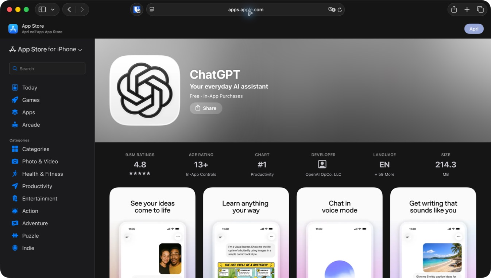

The overview presents the product as almost entirely neutral: white phone surfaces, restrained black controls, and soft pastel light outside the device frame. The marketing colour belongs around the product, not inside the reading surface. The visible chat interface keeps top chrome minimal and reserves the bottom edge for a single persistent composer.

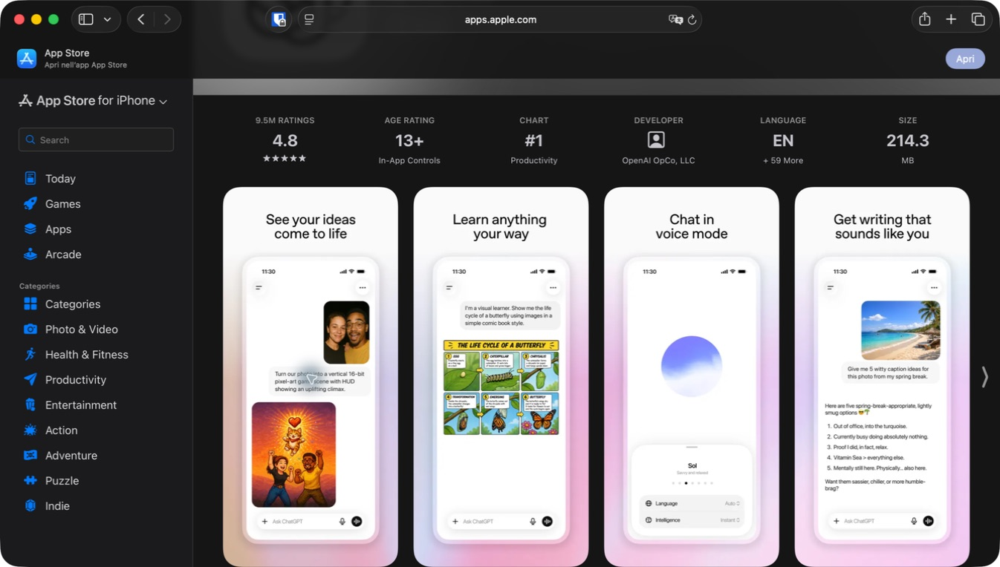

### Visible patterns

- Assistant content sits directly on the page. User prompts are compact grey rounded surfaces; the assistant response is mostly unboxed.
- The composer uses a leading add action, a plain-language prompt label, a microphone, and one high-contrast circular voice/send action.
- Images and educational visual results are inserted into the conversation without changing the overall reading hierarchy.
- Voice is a dedicated mode with a large focal object and a bottom control sheet rather than a tiny inline recording state.
- The top chrome remains quiet even when the response is rich.

### Product lesson

The strongest quality is restraint. The app does not make every capability permanently visible. It gives the answer most of the screen and lets the composer carry the next action. LibreChat should preserve this reading calm even when the server exposes far more capability.

### Risk to avoid

A similarly quiet interface can become dishonest if the effective model, agent, server, project, tools, or privacy scope is hidden. LibreChat needs a compact execution contract that ChatGPT's single-provider context does not need to expose as explicitly.

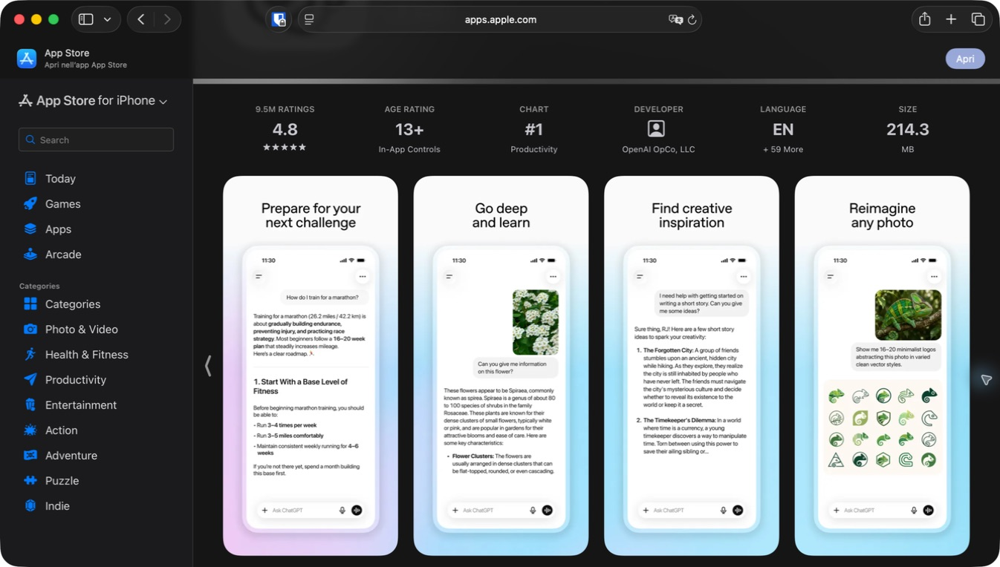

The second set reinforces a repeatable structure: user request at the top, substantial assistant response below, occasional image or generated media, and an unchanged composer. The app does not redesign the screen for training advice, plant identification, creative writing, or image transformation.

### Accessibility verification hypotheses

- The small top controls and compact composer icons need hit-target and VoiceOver verification.
- Long unboxed assistant prose needs predictable heading, list, link, and reading-order semantics.
- Streaming should not repeatedly move focus or announce fragments.

## 2. Claude

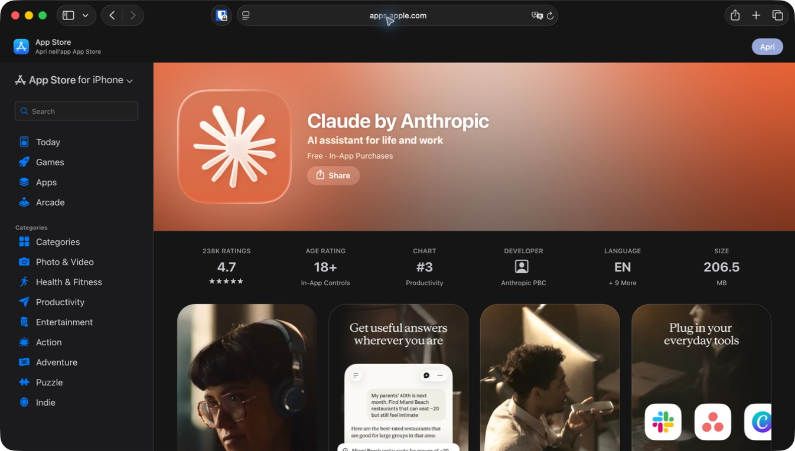

Claude uses a warmer identity than ChatGPT but its visible product surfaces remain restrained. The cream chat canvas, black text, sparse controls, and a single warm accent create an editorial rather than dashboard-like reading experience.

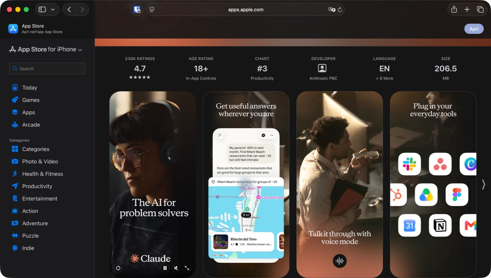

### Visible patterns

- Normal answer content remains quiet and readable, while location or map results become a bounded rich region.
- Voice mode becomes a dedicated high-contrast surface with a single dominant audio control.
- Connected services are represented by recognizable app identities in a grid; external scope is not shown as anonymous JSON or generic tool names.
- The promotional video frame uses full-screen imagery, but the adjacent product frames keep operational UI simple.

### Product lesson

Connected services and non-text work should have recognizable provenance. In LibreChat, an MCP server, tool, OAuth connection, or project source should not disappear behind a generic spinner. The user should see which service or tool is involved and whether it needs a decision.

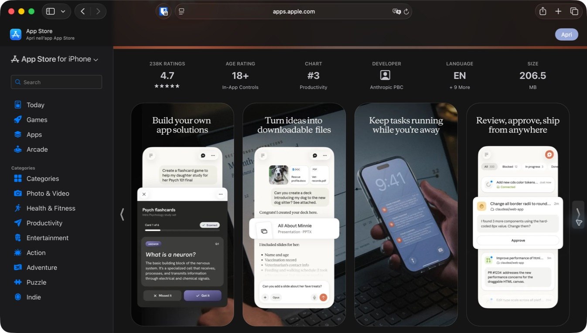

### Visible patterns

- An app-like artifact is shown as a substantial dark card layered over the chat, with its own close control and state.
- Generated downloadable files appear as explicit file objects with type identity rather than raw links in prose.
- Work continuing away from the foreground is represented with a notification, making durability part of the product promise.
- A task board exposes status groupings, progress rows, and a direct approval action. Approval is a work state, not an error.

### Product lesson

This is the strongest competitor evidence for LibreChat's differentiator: generation, artifacts, files, and human approval are durable objects. The native app should use typed semantic surfaces for each while keeping one shared activity language.

### Risk to avoid

Layering every rich result as a card on top of chat can create nested scrolling and inaccessible focus traps. On iPhone, LibreChat should route large artifacts to a dedicated destination with an explicit return path. On iPad, an inspector is appropriate only when the reading/task relationship benefits from simultaneous visibility.

### Accessibility verification hypotheses

- Artifact close and approval controls need explicit labels and 44-point minimum targets.
- Background notifications must not expose private prompt or tool content by default.
- Connected-app grids need clear names and authorization state, not logo-only accessibility.

## 3. Google Gemini

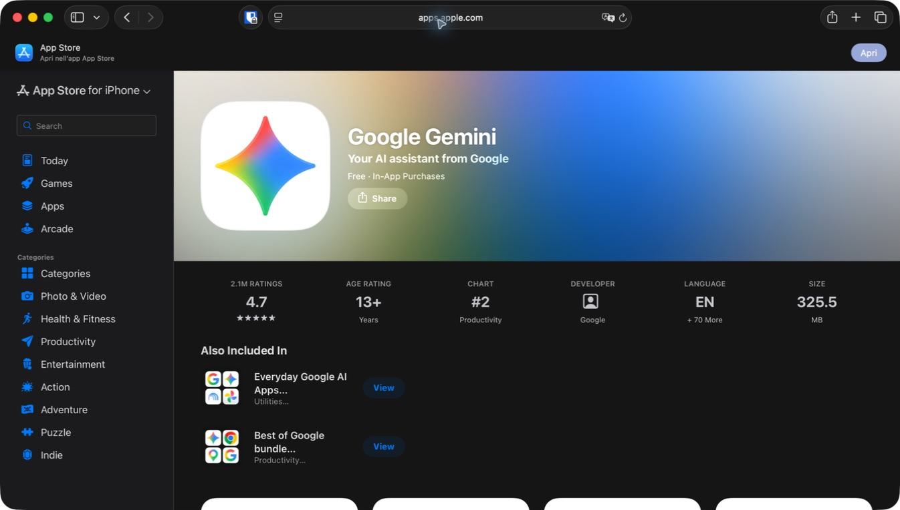

Gemini's listing leads with a broad colour field, but the captured product uses a dark, high-contrast chat surface. A model label is visible in the top bar and richer capabilities appear as modes inside the same product shell.

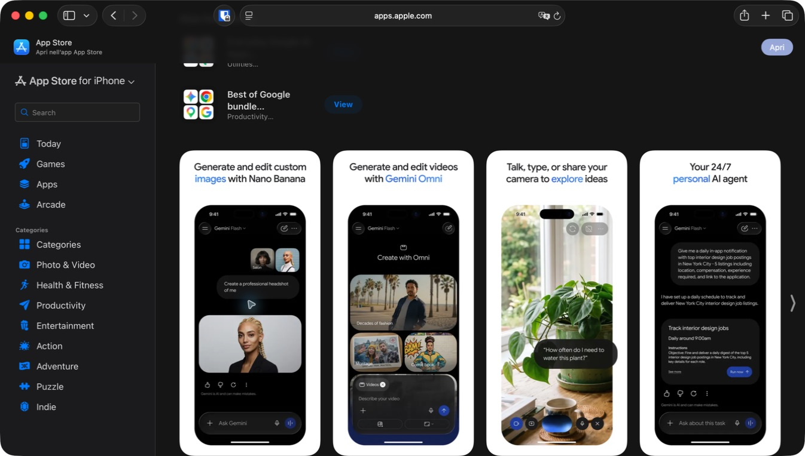

### Visible patterns

- Image and video creation are presented as task-specific modes with their own composer content and media previews.
- Camera conversation becomes a dedicated live surface with capture, audio, and close controls anchored around the live image.
- A persistent personal agent appears as a bounded task card with a clear run action.
- The active model or mode remains visible in the top area instead of being buried entirely in settings.

### Product lesson

Some capabilities deserve a mode transition because their input and result shape are genuinely different. LibreChat should not force live camera, voice, artifact editing, file review, or complex agent work through the same tiny text-only affordance. The transition must remain reversible and keep the conversation context understandable.

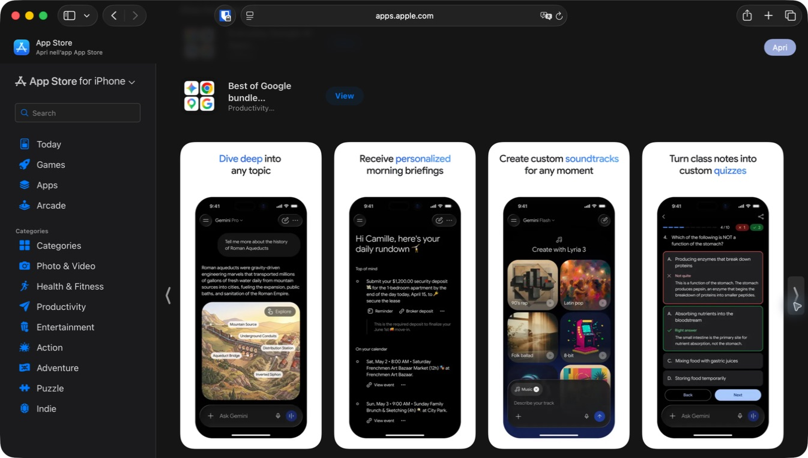

### Visible patterns

- Research output uses an illustrated, interactive-looking result inside the conversation rather than prose alone.
- A daily briefing includes linked actions such as reminders and calendar items, keeping external effects visible.
- Music generation has a dedicated media canvas.
- A quiz is a full interaction with progress, answer states, and navigation rather than a markdown imitation.

### Product lesson

Rich output should be represented by native semantic components when it has state or action. LibreChat's tool results, generated files, quizzes/forms, and artifact outputs should not be flattened into one markdown renderer.

### Risk to avoid

Mode proliferation can fragment the product. LibreChat should expose modes only when the server capability and native implementation are both proven. A single capability sheet plus visible active-state chips is preferable to a permanent mode carousel.

### Accessibility verification hypotheses

- Camera overlays need strong contrast across arbitrary imagery.
- Interactive result cards need logical focus order, selected state, and non-colour correctness indicators.
- Model and mode controls must expose selection traits rather than relying on small visual labels.

## 4. Perplexity

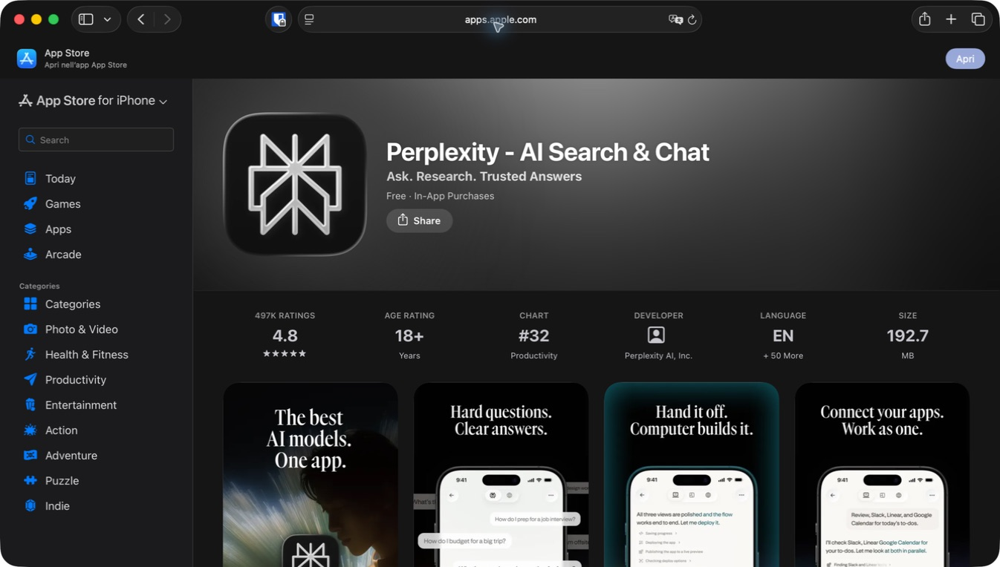

Perplexity visually positions the product as a research and action system. The marketing surface is dramatic, but the captured phone UI is predominantly white with a compact top mode/navigation row and a persistent follow-up composer.

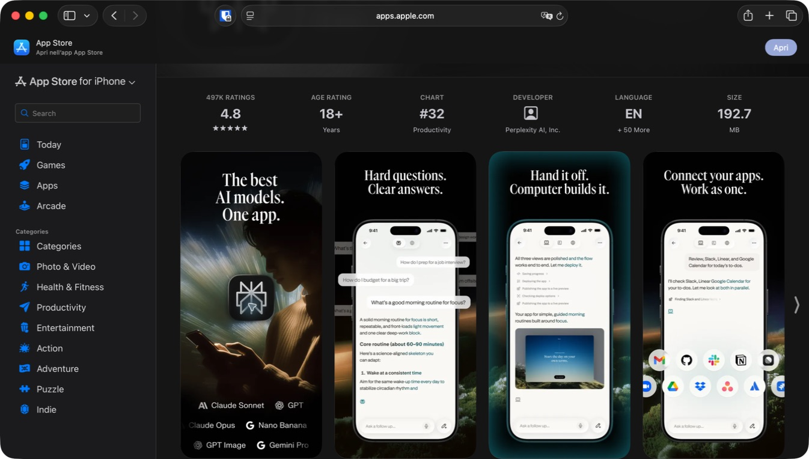

### Visible patterns

- The product makes model breadth explicit while keeping the answer surface relatively plain.
- Delegated computer work is shown with a checklist/progress sequence and a visual output preview.
- Connected apps are represented through recognizable icons and explicitly named work in the answer.
- The composer remains available as “Ask a follow-up,” preserving conversation continuity during richer work.

### Product lesson

Long-running work benefits from a concise, user-facing plan with observable progress and a stable refinement path. LibreChat can derive this from run steps, tool activity, steers, pending interactions, and reconciliation without exposing transport internals.

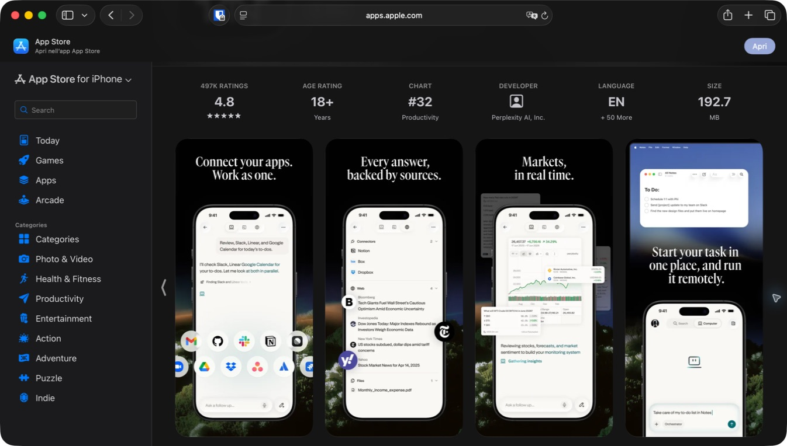

### Visible patterns

- Source scope becomes a visible list with publisher or connector identity.
- Market data is rendered as a proper chart/result surface rather than described textually.
- Work can be started on one device and continued or observed on another.
- The top navigation appears to distinguish search, computer/action, and other work contexts.

### Product lesson

Provenance should be part of reading. Sources, files, connected services, and tools should remain inspectable from the relevant answer or task, not hidden in an after-the-fact diagnostics screen.

### Risk to avoid

The top mode row is compact and icon-heavy. LibreChat has more server-dependent capability combinations; copying this density would create ambiguous or disabled icons. Use plain-language labels when the action changes scope or authorization.

### Accessibility verification hypotheses

- Source brand marks require textual names and source counts.
- Progress lists need status, not colour or checkmarks alone.
- Compact top-mode icons require selected-state and hit-target testing.

## 5. Poe

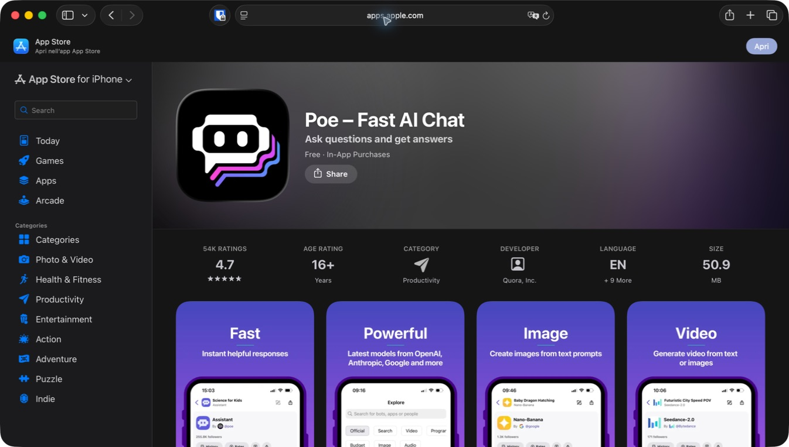

Poe is a useful contrast because the catalog is the product. Its purple identity is persistent, its screens foreground individual bots and models, and content creation categories are visible very early.

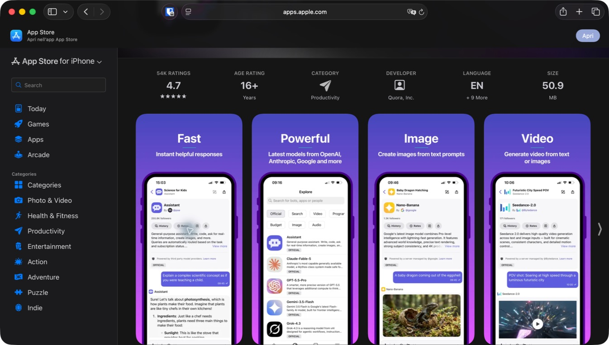

### Visible patterns

- Each assistant has explicit identity, creator/provider, follower/usage information, and official status.
- Discoverability is driven by a searchable catalog with categories such as official, search, video, image, and audio.
- Image and video creation are represented as different assistants rather than one universal mode.
- Conversation content uses coloured user bubbles and assistant identity headers.

### Product lesson

LibreChat needs a strong target picker because model specs, assistants, agents, endpoints, and presets can otherwise become an undifferentiated raw list. It should borrow Poe's explicit identity and provenance, but organize targets around task fit, capability, permission, and recent use instead of popularity metrics.

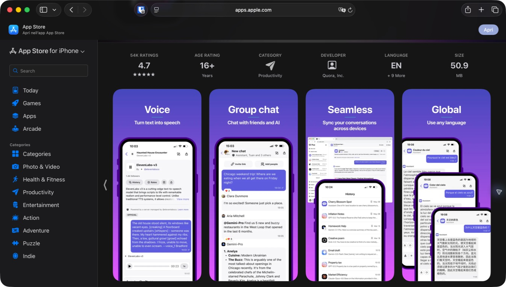

### Visible patterns

- Voice output is represented as an inline audio object with playback controls.
- Group chat includes people and multiple assistants in one thread with clear speaker identity.
- Cross-device sync is visualized through a shared history.
- Multilingual use is presented as the same conversation pattern, not a separate utility.

### Product lesson

Participant identity matters as conversations become multi-agent or collaborative. LibreChat run steps, agents, tool outputs, and future shared work should preserve a clear “who produced this” relationship.

### Risk to avoid

The catalog-heavy approach produces high information density and can make a simple first question feel like model shopping. LibreChat should keep the default target stable and move discovery into a purposeful sheet.

### Accessibility verification hypotheses

- Dense bot metadata and small category controls need large-text reflow testing.
- Group-chat speaker identity must not rely on colour or avatar alone.
- Audio cards need adjustable playback semantics and clear state announcements.

## 6. Grok

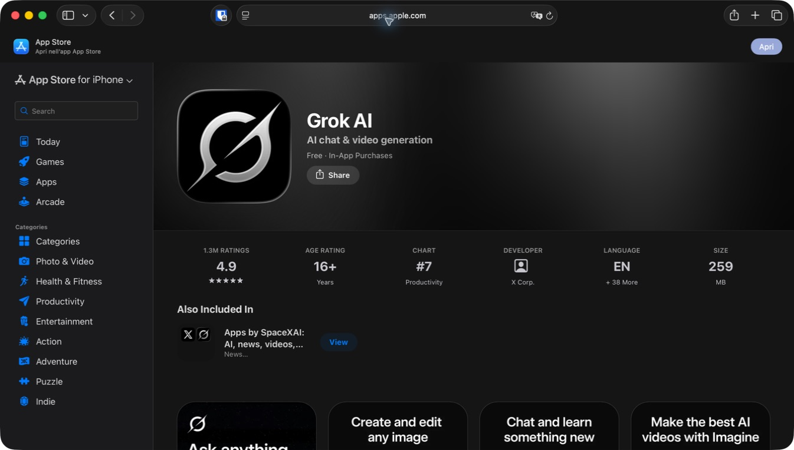

Grok presents a black, media-forward product. The visible interface separates Ask and Imagine near the top, uses inline social/web content, and gives media generation a prominent role.

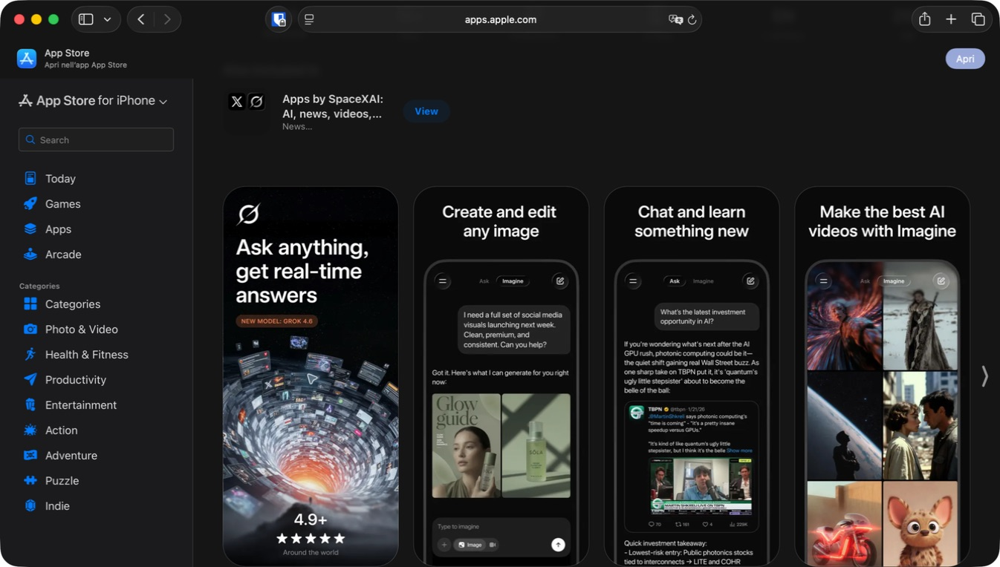

### Visible patterns

- Ask and Imagine are explicit top-level modes.
- Generated images and videos appear as large inline grids.
- Real-time/social content is embedded directly inside an answer.
- The composer remains visible across text and media modes.

### Product lesson

When output is visual, the product should give it enough space. LibreChat's generated files, images, charts, Mermaid, and artifacts should become purpose-built viewers while the chat keeps a compact provenance link.

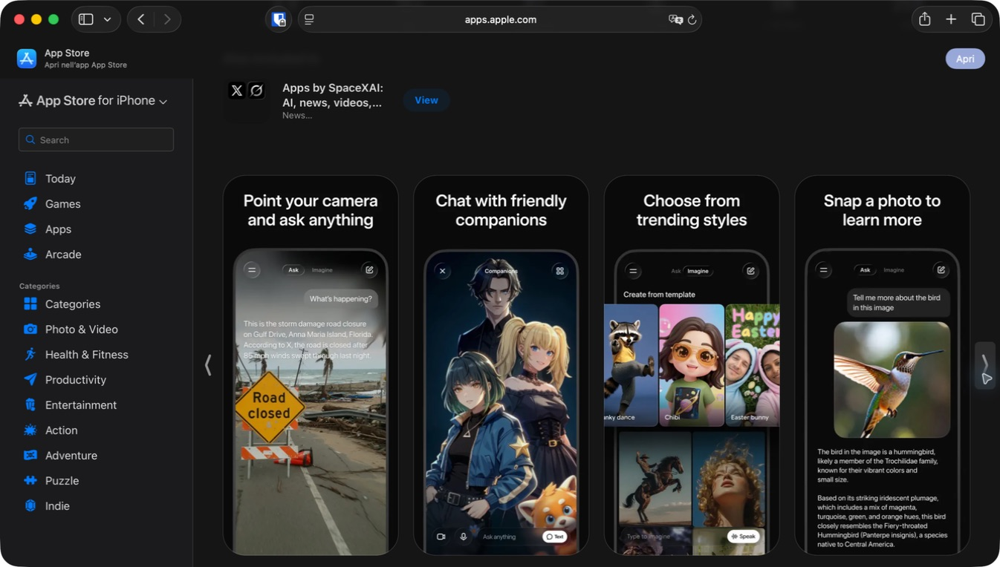

### Visible patterns

- Camera input uses a full-screen visual mode with text/audio controls overlaid at the bottom.
- Companion chat is visually and conceptually distinct from normal assistant work.
- Image generation exposes a template/style gallery.
- Visual identification returns an image plus explanatory prose in one surface.

### Product lesson

Personality and play can be valuable, but they should be deliberate modes rather than leaking into every work conversation. LibreChat should let server-defined agents carry identity while the app chrome stays coherent and trustworthy.

### Accessibility verification hypotheses

- Overlay controls need contrast protection over every camera frame.
- A style gallery needs named selections and selected-state traits.
- Companion imagery must not crowd out transcript access or clear exit controls.

## Cross-product comparison

| Design question | ChatGPT | Claude | Gemini | Perplexity | Poe | Grok | Native LibreChat decision |
|---|---|---|---|---|---|---|---|
| Default reading surface | Very calm, mostly unboxed | Calm, editorial | Dark, mode-aware | Plain answer with compact mode controls | Identity-heavy bot thread | Dark, media-forward | Calm semantic background; no glass or heavy bubbles around assistant prose. |
| Target/mode visibility | Quiet, near conversation/composer | Quiet, near chat | Visible model/mode | Compact top work modes | Central catalog identity | Ask/Imagine segmentation | Full-width tappable execution envelope near composer; authoritative target and scope. |
| Composer | Compact plus/text/mic/action | Compact plus/text/mic/warm send | Mode-specific but persistent | Follow-up composer remains during tasks | Bot-specific, capability-rich | Persistent across Ask/Imagine | One primary field; capability menu; visible active scope; Send/Stop stable. |
| Long-running work | Not prominent in accepted frames | Notification and task approval | Agent task card | Checklist, delegated computer work | Not prominent | Not prominent | Durable generation activity with Needs You, reconnect, and authoritative recovery. |
| Rich output | Images and voice | Artifact, file, map, approval board | Research, media, brief, quiz | Charts, sources, computer result | Audio, image/video bots, group chat | Social cards, images/video, camera | Typed native result components; full-screen artifact route on iPhone. |
| Provenance | Relatively quiet | External app/tool identity | Service actions inside brief | Strong sources/connectors | Strong bot/provider identity | Social/web embedding | Source/tool/file/agent identity inspectable from answer and execution envelope. |
| Main risk | Hidden execution scope | Nested card complexity | Too many modes | Dense icon modes | Catalog overload | Media/personality distraction | Calm default with progressive, capability-proven depth. |

## Design decisions for the native LibreChat app

### Adopt

1. **Make the execution envelope the target control.** Across the accepted evidence, target or mode identity is visible and directly addressable. The current LibreChat summary plus a separate chevron splits meaning from action. The entire truthful summary should be one 44-point native control that opens a new-chat target review while preserving the current conversation.
2. **Keep assistant prose on the reading surface.** Use user-message containment sparingly; do not wrap every assistant response in a card.
3. **Keep Send/Stop spatially stable.** The action may change state, but its composer position should not jump.
4. **Use one capability entry point.** Attachments, camera, prompts, voice, tools, privacy, and source scope expand from a clear native menu or sheet and become visible state when active.
5. **Promote long-running generation to a durable activity object.** State transitions and pending decisions publish immediately; prose remains coalesced.
6. **Use typed rich-result components.** A file is a file, an approval is a decision, a source set is provenance, an artifact is a destination, and a chart or media object should not be fake markdown.
7. **Keep provenance close to the work.** Show human names for model/agent/tool/server/source scope; retain raw identifiers only in diagnostics.

### Reject

1. A permanent mode carousel for every server capability.
2. A bot marketplace as the home screen.
3. Coloured or translucent assistant bubbles around long prose.
4. Nested scrolling cards for large artifacts on iPhone.
5. Logo-only connector or tool UI.
6. Decorative “thinking” animation without recoverable job semantics.
7. Glass on content, code, tool output, sources, or approval surfaces.

## First implementation slice derived from the evidence

**Status:** implemented and build-verified; updated interaction remains runtime-unproven because no Simulator was booted.

The first bounded visual change is deliberately small and structural:

- Replace the split execution-summary-plus-chevron row with one full-width, 44-point semantic control.
- Preserve the exact current behavior: it starts a reviewed new chat with another authoritative target and never retargets the current conversation.
- Keep the target, attachment state, tools, and server identity visible before send.
- Keep disabled reasons and VoiceOver value truthful.
- Retain iOS 17 material and Reduce Transparency behavior; Liquid Glass remains limited to the composer control surface on iOS 26.

This is preferable to immediately recolouring the app or copying a competitor's top bar. It improves the relationship between visible state and available action, which is a repeated pattern across the accepted evidence and a current usability weakness in the native shell.

Verification after the change:

- LibreChatCore: 350 Swift Testing checks plus 4 XCTest checks, 354 total across 43 suites, at `/private/tmp/librechat-visual-audit-core`.
- Generic Simulator build-for-testing: `/private/tmp/LibreChatIOS-CompetitiveVisual-20260819-Derived`.
- Generic iOS device build: `/private/tmp/LibreChatIOS-CompetitiveVisual-20260819-Device-Derived`.
- The deterministic target-switch UI test was updated to treat the execution envelope itself as the button and compiled in the test bundle. It did not execute because no Simulator was booted.

## Remaining evidence required

The visual baseline is now strong enough to make bounded hierarchy decisions, but it does not complete the product audit. The next accepted evidence must come from real interactive states:

1. Current native LibreChat: library, New Chat, target picker, long conversation, active generation, reconnect, pending approval, artifact, files, server switch, iPad.
2. At least ChatGPT and Claude authenticated: library, empty chat, target/mode sheet, attachment path, streaming/Stop, and one rich result.
3. Manual accessibility: VoiceOver focus order, largest Dynamic Type, Reduce Motion, Reduce Transparency, Switch Control, and external keyboard.
4. Live LibreChat protocol acceptance: send, persisted history, stop, background/foreground resume, one token refresh, and one pending decision.

No exact competitor spacing, animation, or accessibility behavior should be copied until that interaction evidence exists.
